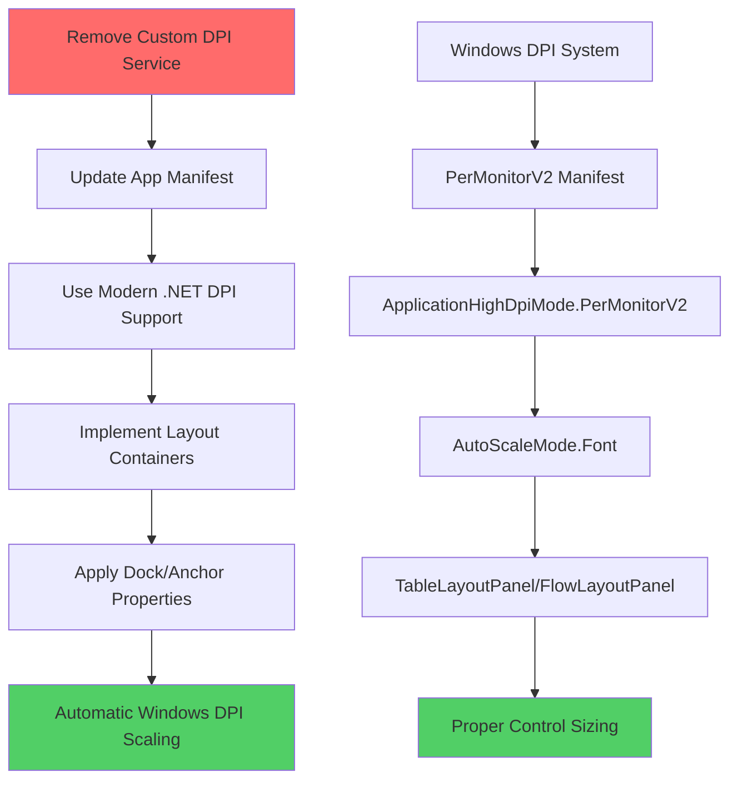

# DPI Scaling Modernization Plan for HWID Checker

## Executive Summary

This plan addresses the critical DPI scaling issues in the HWID Checker application where the interface becomes unusable at any Windows scaling setting other than 100%. The root cause is conflicting DPI handling systems - the application uses both custom manual scaling AND .NET 8's automatic DPI support, causing scaling wars and unusable interfaces.

## Problem Analysis

### Current Issues Identified

1. **Scaling Conflicts**: Both manual `DpiScalingService` and `ApplicationHighDpiMode.PerMonitorV2` are active
2. **Missing DPI Manifest Declarations**: App manifest lacks proper DPI awareness declarations
3. **Over-Complex Scaling Logic**: 300+ lines of custom scaling code fighting Windows Forms
4. **Double Scaling**: `AutoScaleMode.Dpi` combined with manual scaling causes controls to be scaled twice
5. **Layout Positioning Issues**: Fixed positioning breaks at non-100% scaling levels

### Root Cause

The application implements a complex custom DPI scaling system on top of .NET 8's modern DPI handling, which already provides excellent DPI support when properly configured. This creates a "scaling war" where both systems attempt to scale the UI, resulting in oversized windows, invisible buttons, and unusable interfaces.

## Solution Architecture



## Implementation Phases

### Phase 1: Modernize DPI Configuration

#### 1.1 Update Application Manifest
**File**: `HWID-Checkers/Software-Project/source/app.manifest`

**Current State**: Basic manifest with admin privileges only
**Target State**: Include proper DPI awareness declarations

```xml
<?xml version="1.0" encoding="utf-8"?>
<assembly manifestVersion="1.0" xmlns="urn:schemas-microsoft-com:asm.v1">
  <assemblyIdentity version="1.0.0.0" name="HWIDChecker"/>
  <trustInfo xmlns="urn:schemas-microsoft-com:asm.v2">
    <security>
      <requestedPrivileges xmlns="urn:schemas-microsoft-com:asm.v3">
        <requestedExecutionLevel level="requireAdministrator" uiAccess="false" />
      </requestedPrivileges>
    </security>
  </trustInfo>
  
  <!-- Modern DPI Awareness Declaration -->
  <asmv3:application xmlns:asmv3="urn:schemas-microsoft-com:asm.v3">
    <asmv3:windowsSettings>
      <dpiAware xmlns="http://schemas.microsoft.com/SMI/2005/WindowsSettings">PerMonitorV2</dpiAware>
      <dpiAwareness xmlns="http://schemas.microsoft.com/SMI/2016/WindowsSettings">PerMonitorV2</dpiAwareness>
    </asmv3:windowsSettings>
  </asmv3:application>
</assembly>
```

#### 1.2 Verify Project Configuration
**File**: `HWID-Checkers/Software-Project/source/HWIDChecker.csproj`

**Keep**: `<ApplicationHighDpiMode>PerMonitorV2</ApplicationHighDpiMode>` (Line 9)
**Rationale**: This setting works correctly with proper manifest declarations

### Phase 2: Remove Custom DPI System

#### 2.1 Delete DpiScalingService
**Action**: Remove `HWID-Checkers/Software-Project/source/Services/DpiScalingService.cs`
**Rationale**: 362 lines of complex scaling logic that conflicts with Windows Forms DPI handling

#### 2.2 Create Simple DPI Helper
**File**: `HWID-Checkers/Software-Project/source/Utils/DpiHelper.cs`

```csharp
using System.Drawing;

namespace HWIDChecker.Utils
{
    /// <summary>
    /// Simple helper for DPI-related operations that work with Windows Forms automatic scaling
    /// </summary>
    public static class DpiHelper
    {
        /// <summary>
        /// Creates a font that will be automatically scaled by Windows Forms
        /// </summary>
        public static Font CreateFont(string familyName, float size, FontStyle style = FontStyle.Regular)
        {
            return new Font(familyName, size, style);
        }
        
        /// <summary>
        /// Returns the recommended base size for forms - Windows will handle scaling
        /// </summary>
        public static Size GetBaseFormSize(int width, int height)
        {
            return new Size(width, height);
        }
    }
}
```

#### 2.3 Remove DpiAwareForm Base Class
**Action**: Delete `HWID-Checkers/Software-Project/source/UI/Forms/DpiAwareForm.cs`
**Rationale**: No longer needed with proper Windows Forms DPI handling

### Phase 3: Modernize Form Architecture

#### 3.1 Update MainForm Constructor
**File**: `HWID-Checkers/Software-Project/source/UI/Forms/MainForm.cs`

**Remove**:
- DPI service initialization
- Custom DPI change handling
- Manual scaling operations

**New Implementation**:
```csharp
using System.Windows.Forms;
using HWIDChecker.UI.Forms;

namespace HWIDChecker.UI.Forms
{
    public partial class MainForm : Form
    {
        private readonly MainFormInitializer initializer;

        public MainForm()
        {
            // Let Windows Forms handle DPI automatically
            initializer = new MainFormInitializer(this);
            initializer.Initialize();
        }
    }
}
```

#### 3.2 Update MainFormLayout
**File**: `HWID-Checkers/Software-Project/source/UI/Forms/MainFormLayout.cs`

**Key Changes**:
- Remove all DPI service references
- Use `AutoScaleMode.Font` instead of `AutoScaleMode.Dpi`
- Replace fixed sizing with layout containers
- Use standard font creation

**Critical Updates**:
```csharp
public void InitializeLayout(Form form)
{
    // Set base form properties - Windows will scale automatically
    form.Text = "HWID Checker";
    form.Size = new Size(790, 820); // Base size - let Windows scale this
    form.StartPosition = FormStartPosition.CenterScreen;
    form.BackColor = ThemeColors.MainBackground;
    form.ForeColor = ThemeColors.PrimaryText;

    // CRITICAL: Use Font-based scaling, not DPI scaling
    form.AutoScaleMode = AutoScaleMode.Font;
    form.AutoScaleDimensions = new SizeF(96F, 96F);

    CreateLayoutStructure(form);
}
```

### Phase 4: Implement Layout Container Architecture

#### 4.1 Replace Fixed Positioning with Layout Containers
**Objective**: Use TableLayoutPanel and FlowLayoutPanel for responsive layouts

```csharp
private void CreateLayoutStructure(Form form)
{
    // Main layout container
    var mainLayout = new TableLayoutPanel
    {
        Dock = DockStyle.Fill,
        ColumnCount = 1,
        RowCount = 2
    };
    
    // Configure row styles for responsive layout
    mainLayout.RowStyles.Add(new RowStyle(SizeType.Percent, 85F)); // Content area
    mainLayout.RowStyles.Add(new RowStyle(SizeType.Percent, 15F)); // Button panel
    
    // Add controls to layout container
    mainLayout.Controls.Add(CreateContentArea(), 0, 0);
    mainLayout.Controls.Add(CreateButtonPanel(), 0, 1);
    
    form.Controls.Add(mainLayout);
}
```

#### 4.2 Update Button Layout
**Objective**: Use FlowLayoutPanel with proper wrapping for high DPI

```csharp
private FlowLayoutPanel CreateButtonPanel()
{
    var buttonPanel = new FlowLayoutPanel
    {
        Height = 60, // Base height - Windows will scale
        Dock = DockStyle.Fill,
        FlowDirection = FlowDirection.LeftToRight,
        WrapContents = true, // Allow wrapping at high DPI
        AutoSize = false,
        BackColor = ThemeColors.ButtonPanelBackground
    };
    
    // Create buttons with AutoSize for automatic scaling
    var buttons = new[]
    {
        new Button { Text = "Refresh", AutoSize = true },
        new Button { Text = "Export", AutoSize = true },
        new Button { Text = "Clean Devices", AutoSize = true },
        new Button { Text = "Clean Logs", AutoSize = true },
        new Button { Text = "Check Updates", AutoSize = true },
        new Button { Text = "Sectioned View", AutoSize = true }
    };
    
    buttonPanel.Controls.AddRange(buttons);
    return buttonPanel;
}
```

### Phase 5: Update Control Creation

#### 5.1 Modernize TextBox Creation
**Remove**: All manual scaling operations
**Use**: Dock/Anchor properties for automatic scaling

```csharp
OutputTextBox = new TextBox
{
    Multiline = true,
    ReadOnly = true,
    ScrollBars = ScrollBars.Vertical,
    Dock = DockStyle.Fill, // Automatic scaling
    WordWrap = true,
    BackColor = ThemeColors.TextBoxBackground,
    ForeColor = ThemeColors.TextBoxText,
    BorderStyle = BorderStyle.None,
    Font = new Font("Consolas", 9.75f) // Standard font creation
};
```

#### 5.2 Update All Other Forms
**Files to Update**:
- `CompareForm.cs`
- `CleanDevicesForm.cs`
- `CleanLogsForm.cs`
- `SectionedViewForm.cs`
- `WhitelistDevicesForm.cs`

**Changes**:
- Remove DPI service dependencies
- Use standard Windows Forms scaling
- Apply layout container patterns

### Phase 6: Testing Strategy

#### 6.1 Test Matrix
| Windows Scaling | Expected Behavior | Validation Criteria |
|----------------|-------------------|-------------------|
| **100% (96 DPI)** | Perfect baseline | All controls visible, properly proportioned |
| **125% (120 DPI)** | Slightly larger, fully usable | Text readable, buttons clickable |
| **150% (144 DPI)** | Noticeably larger but usable | Window fits screen, no cut-off controls |
| **175% (168 DPI)** | Large but functional | All features accessible |
| **200% (192 DPI)** | Very large but usable | No unusable interface elements |

#### 6.2 Multi-Monitor Testing
- **Different DPI monitors**: Test moving between monitors with different scaling
- **Runtime DPI changes**: Test changing DPI while app is running
- **Monitor configuration changes**: Test adding/removing monitors

#### 6.3 Regression Testing
- **Core functionality**: Ensure hardware scanning still works
- **Export features**: Verify file export functionality
- **Comparison tools**: Test hardware comparison features
- **Cleaning utilities**: Validate device and log cleaning

## Implementation Benefits

### ✅ Fixes Current Issues
- **Eliminates scaling conflicts** between custom and automatic systems
- **Prevents oversized windows** at high DPI settings
- **Ensures button visibility** at all scaling levels
- **Provides smooth multi-monitor support**
- **Resolves "unusable at non-100%" problem**

### ✅ Simplifies Codebase
- **Removes 300+ lines** of complex DPI scaling code
- **Eliminates maintenance burden** of custom scaling logic
- **Uses Windows standard DPI handling** (more reliable)
- **Reduces debugging complexity** for UI issues
- **Future-proof** for new DPI settings and Windows versions

### ✅ Improves User Experience
- **Consistent scaling** across all Windows versions
- **Proper text clarity** at high DPI displays
- **Responsive layout** that adapts to different screen sizes
- **Professional appearance** at all scaling levels
- **Reliable multi-monitor** support

## Risk Mitigation

| Risk | Probability | Impact | Mitigation Strategy |
|------|-------------|--------|-------------------|
| **Breaking existing layouts** | Medium | High | Phase-by-phase implementation with testing |
| **Font sizes incorrect** | Low | Medium | Use Windows Forms standard font handling |
| **Controls positioned wrong** | Medium | High | Replace absolute positioning with layout containers |
| **Performance impact** | Low | Low | Modern Windows Forms DPI is highly optimized |
| **Compatibility issues** | Low | Medium | Target .NET 8 with proven DPI support |

## Success Metrics

### Primary Success Criteria
1. **Application usable at 125% scaling** - All buttons visible and clickable
2. **Application usable at 150% scaling** - Window fits on screen, all features accessible
3. **Application usable at 200% scaling** - Large but functional interface
4. **Multi-monitor support** - Smooth transitions between different DPI monitors

### Secondary Success Criteria
1. **Code simplification** - Remove 200+ lines of custom DPI code
2. **Maintenance reduction** - Eliminate custom DPI debugging
3. **Future compatibility** - Support upcoming high DPI displays
4. **Performance improvement** - Faster UI rendering with native Windows scaling

## Implementation Timeline

| Phase | Duration | Dependencies | Deliverables |
|-------|----------|--------------|-------------|
| **Phase 1: Configuration** | 1 day | None | Updated manifest and project files |
| **Phase 2: Remove Custom DPI** | 1 day | Phase 1 | Deleted DpiScalingService, created DpiHelper |
| **Phase 3: Update Forms** | 2 days | Phase 2 | Modernized MainForm and layout classes |
| **Phase 4: Layout Containers** | 2 days | Phase 3 | Implemented TableLayoutPanel/FlowLayoutPanel |
| **Phase 5: Update Controls** | 1 day | Phase 4 | Updated all form controls |
| **Phase 6: Testing** | 2 days | Phase 5 | Validated across all DPI settings |

**Total Estimated Time**: 9 days

## Conclusion

This modernization plan eliminates the root cause of DPI scaling issues by removing conflicting custom scaling logic and leveraging Windows Forms' mature DPI handling capabilities. The result will be a professional application that works seamlessly at all Windows scaling settings while significantly simplifying the codebase.

The key insight is to **let Windows do the scaling** instead of fighting it with custom logic. This approach is more reliable, maintainable, and future-proof than complex custom scaling implementations.