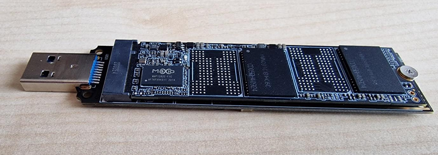
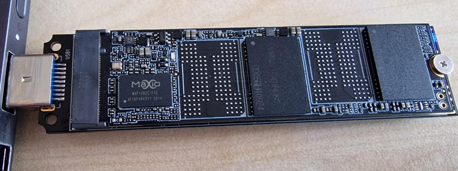
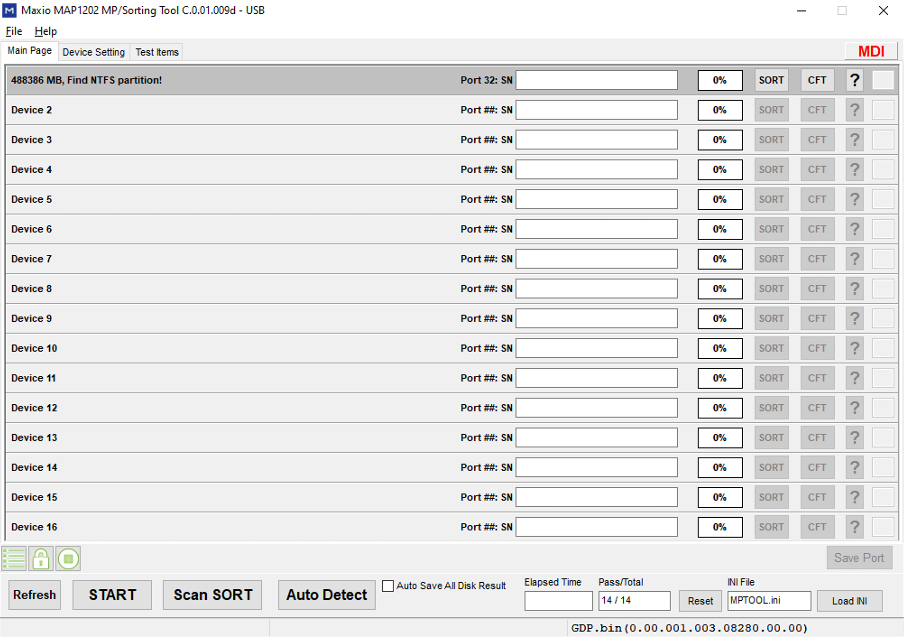
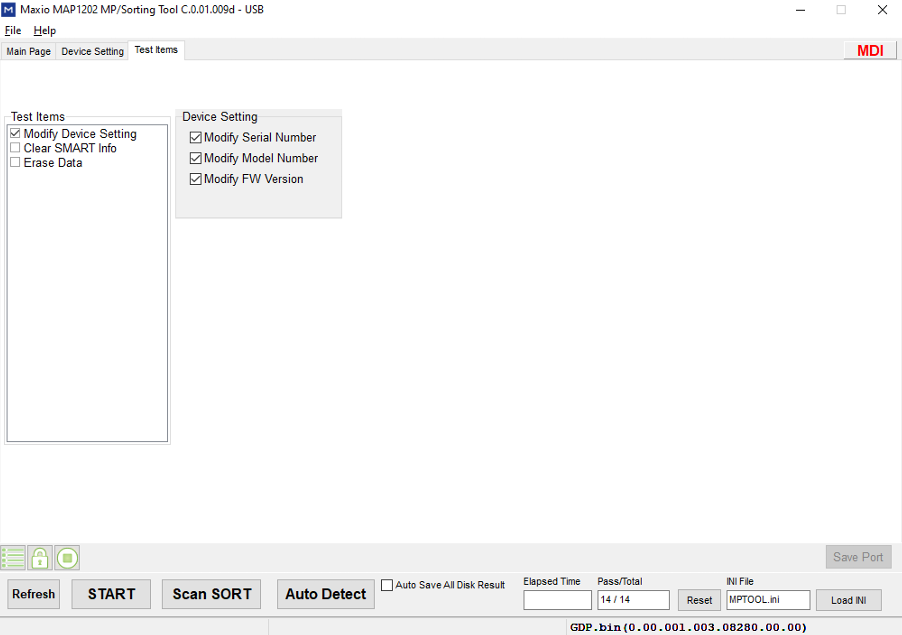
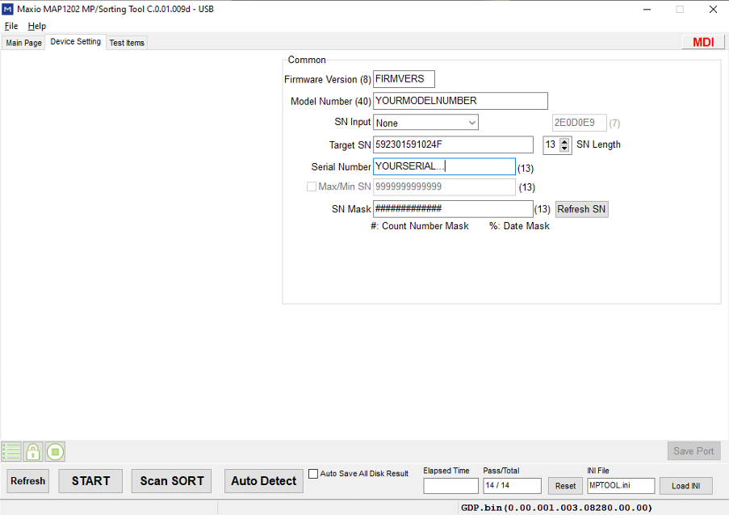

# **M.2 SSD SPOOFING**

> **:warning: WARRANTY VOID DISCLAIMER**  
> Changing the serial number and clearing SMART info will void your warranty!

---

## **Prerequisites**

- Required:
  - **[SM2_SERIAL_CHANGE_TOOL.zip](./M.2-SSD-Files/Images/M2_SERIAL_CHANGE_TOOL.zip)**
  - **A USB-to-M.2 Adapter**
- Optional:
  - **[HWIDChecker.exe](HWIDChecker.exe)**
    - (Optional but recommended to check your before/after SSD details)
  - **A Secondary PC** (with **no anti-cheat** installed)
    - This is optinal, you can use it on your main pc, just no Anti-Cheat open/installed! :)

---

## **Instructions**

Follow these steps carefully to spoof your M.2 SSD.

1. **Plug the M.2 into a USB adapter.**  
   

2. **Connect the USB adapter to your SECOND PC** (ensure **NO ANTICHEAT** is installed).  
   

3. **Open the SERIAL_CHANGE_TOOL** (previously downloaded from the link in Prerequisites).

4. **Go to "Test items".**  
     
   Configure it as shown in the image above.

5. **Next, go to "Device Setting".**  
   

6. **Enter the following details** (follow the recommended format):

   - **Firmware Version**: Use **only numbers**.
   - **Model Number**: Use **only letters & numbers**, up to a maximum of **20 characters**.
   - **Preferred Serial Number**: Must match **TARGET SN LENGTH** (default is **13**).

7. **Return to the "Main Page"** of the tool.

8. **Click "Start"** to begin the spoofing process.

9. **Check the first port** in the tool.

   - When it turns **green**, the process has **completed successfully**.  
     

10. **Unplug the USB adapter** from the PC.

11. **Shutdown** your **MAIN PC**.

12. **Unplug** your **MAIN PC** **completely** (remove the power cable).

13. **Reinstall** the **M.2 SSD** back into the **M.2 slot** of your **MAIN PC**.

14. **Power on** your **MAIN PC**.

15. **Open** [HWIDChecker.exe](HWIDChecker.exe).

16. **Verify** that your **Model Name**, **Firmware Version**, and **Serial Number** have been updated.

---
