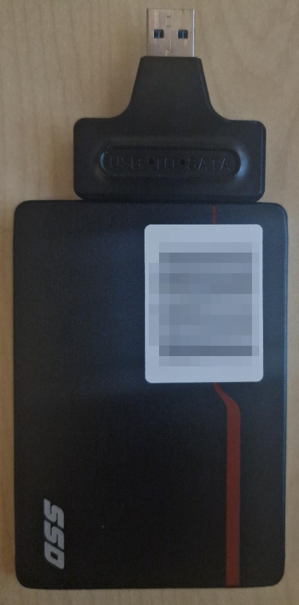
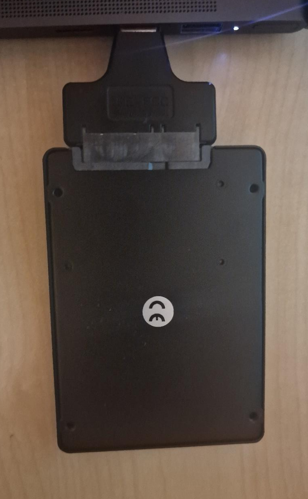
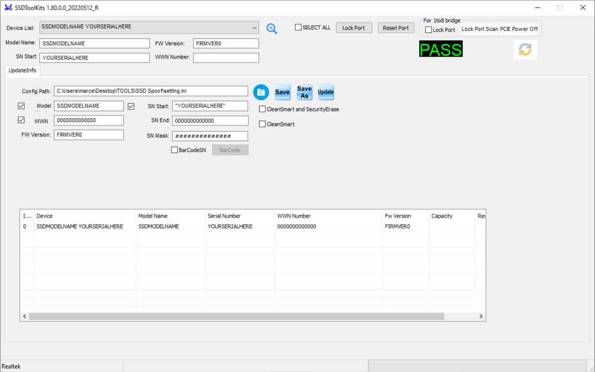
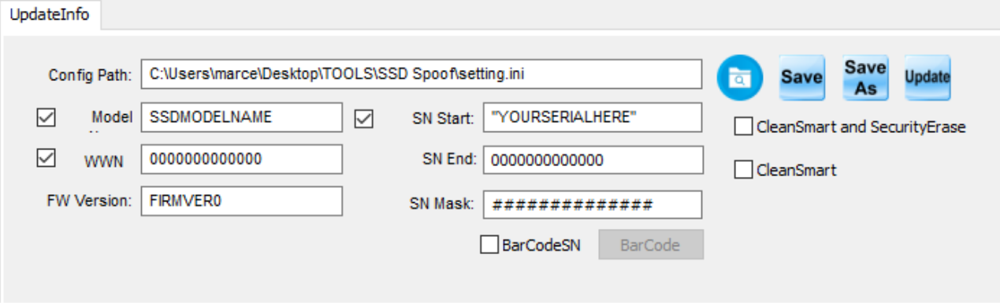
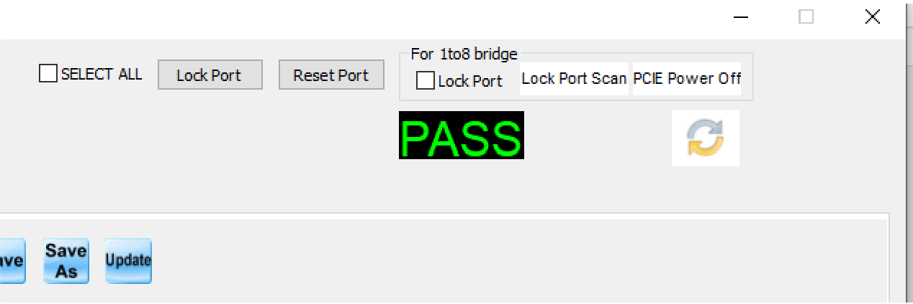

> **:warning: WARRANTY VOID DISCLAIMER**  
> Changing the serial number and clearing SMART info will void your warranty!

# Index

- [M.2 SSD Spoofing](#m2-ssd-spoofing)
- [NORMAL 2.5' SSD Spoofing](#normal-25-ssd-spoofing)

---

# **M.2 SSD SPOOFING**

## **Prerequisites**

- Required:
  - **[M2_SERIAL_CHANGE_TOOL.zip](./M.2-SSD-Files/M2_SERIAL_CHANGE_TOOL.zip)**
  - **A USB-to-M.2 Adapter**
- Optional:
  - **[HWIDChecker.exe](HWIDChecker.exe)**
    - (Optional but recommended to check your before/after SSD details)
  - **A Secondary PC** (with **no anti-cheat** installed)
    - This is optinal, you can use it on your main pc, just no Anti-Cheat open/installed! :)

---

## **Instructions**

Follow these steps carefully to spoof your M.2 SSD.

1. **Plug the M.2 into a USB adapter.**  
   

2. **Connect the USB adapter to your SECOND PC** (ensure **NO ANTICHEAT** is installed).  
   

3. **Open the MXMPTool_MAP1202_USB_V0_01_009d.exe** (previously downloaded from the link in Prerequisites).

4. **Go to "Test items".**  
     
   Configure it as shown in the image above.

5. **Next, go to "Device Setting".**  
   

6. **Enter the following details** (follow the recommended format):

   - **Firmware Version**: Use **only numbers**.
   - **Model Number**: Use **only letters & numbers**, up to a maximum of **20 characters**.
   - **Preferred Serial Number**: Must match **TARGET SN LENGTH** (default is **13**).

7. **Return to the "Main Page"** of the tool.

8. **Click "Start"** to begin the spoofing process.

9. **Check the first port** in the tool.

   - When it turns **green**, the process has **completed successfully**.  
     

10. **Unplug the USB adapter** from the PC.

11. **Shutdown** your **MAIN PC**.

12. **Unplug** your **MAIN PC** **completely** (remove the power cable).

13. **Reinstall** the **M.2 SSD** back into the **M.2 slot** of your **MAIN PC**.

14. **Power on** your **MAIN PC**.

15. **Open** [HWIDChecker.exe](HWIDChecker.exe).

16. **Verify** that your **Model Name**, **Firmware Version**, and **Serial Number** have been updated.

---

## **NORMAL 2.5' SSD SPOOFING**

## **Prerequisites**

- Required:
  - **[SSD_SERIAL_CHANGE_TOOL.zip](./Normal-2.5-SSD-Files/SSD_SERIAL_CHANGE_TOOL.zip)**
  - **A SATA-to-USB with ASMT 2115 Chipset**
- Optional:
  - **[HWIDChecker.exe](HWIDChecker.exe)**
    - (Optional but recommended to check your before/after SSD details)
  - **A Secondary PC** (with **no anti-cheat** installed)
    - This is optinal, you can use it on your main pc, just no Anti-Cheat open/installed! :)

---

## Steps to Follow:

1. Plug the SSD into a USB adapter.  
   

2. Plug the USB adapter into your SECOND PC (**NO ANTICHEAT SHOULD BE INSTALLED**).  
   

3. **Open the SSDToolKits.exe** (previously downloaded from the link in Prerequisites).

4. Check the **top dropdown** to see if your SSD is detected. If not, redo all previous steps.  
   

5. Set your preferred information as follows:

   - **Firmware Version**: Use only numbers (FW Version).
   - **Model Name**: Use only letters, max 20 characters (Model).
   - **Serial Number**: Maximum length is **TARGET SN LENGTH** (default: 13).
   - **WWN**: Not needed.

6. Click **"Save"**.

7. Press **"Update"**.  
   

8. When the program shows **PASS** in the top right corner, everything succeeded.  
   

9. Unplug the **USB adapter**.

10. Shut down your **MAIN PC**.

11. Unplug your **PC completely**.

12. Install the **SSD** back into the **SSD slot** of your PC.

13. Start your **PC**.

14. Open **Hwinfo**.

15. You should now see your updated **Model Name, Firmware Version, and Serial Number**.
