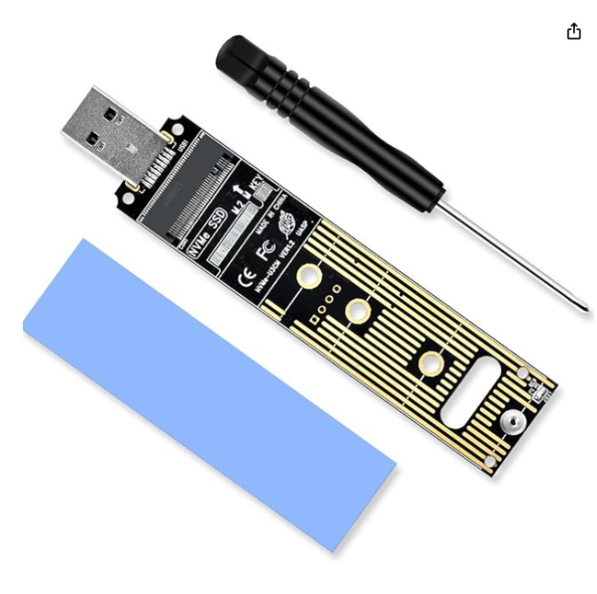

> **:warning: WARRANTY VOID DISCLAIMER**  
> Changing the serial number and clearing SMART info will void your warranty!

# Index

- SPOOF GUIDE:
  - [M.2 SSD Spoofing](#m2-ssd-spoofing)
  - [NORMAL 2.5' SSD Spoofing](#normal-25-ssd-spoofing)

> **The spoofer guid includes info on what SSD's chips work and where you can buy them!**

---

# **M.2 SSD SPOOFING**

## **Prerequisites**

- Compatible SSD(needs a `Maxio MAP1202 Controller`):
  - ✅ **Tested SSD:**
    - [Priventive 512GB](https://priventive.de/products/priventive-m2-nvme-512-gb)
    - [Priventive 1TB](https://priventive.de/products/kopie-von-priventive-m-2-nvme-2280-m-key-1-tb-nulled-serials-no-hwid)
    - [Priventive 2TB](https://priventive.de/products/priventive-m-2-nvme-2280-m-key-2-tb-nulled-serials-no-hwid)
      - **10% COUPON** for priventive.de `HWIDZERO`
        - This coupon is not an affiliat coupon, you get the max out of it.
  - ❓ **Other SSDs (not personally tested):**
    - [Manufacturer Link](https://www.fanxiangssd.com/products/internal-solid-state-drive-fanxiang-s500-nvme-ssd-pcle?variant=45220228399421)
    - [List Of SSD's](https://ssd-tester.de/top_ssd.php)
      - CTRL + F + `MAP1202` then choose.
- Required:

  - **[M2_SERIAL_CHANGE_TOOL.zip](./M.2-SSD-Files/M2_SERIAL_CHANGE_TOOL.zip)**
  - **[USB-to-M.2 Adapter](https://priventive.de/products/m2-usb-adapter)**
    - 

       
A USB-to-M.2 Adapter(Exapnd me to see picture)

      Try to look for a "JMicron JMS583" chipset.

      

       

- Optional:
  - **[HWIDChecker.exe](/HWIDChecker.exe)**
    - (Optional but recommended to check your before/after SSD details)
  - **A Secondary PC** (with **no anti-cheat** installed)
    - This is optinal, you can use it on your main pc, just no Anti-Cheat open/installed! :)

---

## **Instructions**

Follow these steps carefully to spoof your M.2 SSD.

1. **Plug the M.2 into a USB adapter.**  
   

2. **Connect the USB adapter to your SECOND PC** (ensure **NO ANTICHEAT** is installed).  
   

3. **Open the MXMPTool_MAP1202_USB_V0_01_009d.exe** (previously downloaded from the link in Prerequisites).

4. **Go to "Test items".**  
     
   Configure it as shown in the image above.

5. **Next, go to "Device Setting".**  
   

6. **Enter the following details** (follow the recommended format):

   - **Firmware Version**: Use **only numbers**.
   - **Model Number**: Use **only letters & numbers**, up to a maximum of **20 characters**.
   - **Preferred Serial Number**: Must match **TARGET SN LENGTH** (default is **13**).

7. **Return to the "Main Page"** of the tool.

8. **Click "Start"** to begin the spoofing process.

9. **Check the first port** in the tool.

   - When it turns **green**, the process has **completed successfully**.  
     

10. **Unplug the USB adapter** from the PC.

11. **Shutdown** your **MAIN PC**.

12. **Unplug** your **MAIN PC** **completely** (remove the power cable).

13. **Reinstall** the **M.2 SSD** back into the **M.2 slot** of your **MAIN PC**.

14. **Power on** your **MAIN PC**.

15. **Open** [HWIDChecker.exe](/HWIDChecker.exe).

16. **Verify** that your **Model Name**, **Firmware Version**, and **Serial Number** have been updated.

---

## **NORMAL 2.5' SSD SPOOFING**

## **Prerequisites**

- Compatible SSD(Manufacture `YANSEN`):
  - ✅ **Tested SSD:**
    - **Priventive SSD**
      - [Priventive 1TB](https://priventive.de/products/priventive-1-tb-nulled-serials-no-hwid-changeable-serials)
      - [Priventive 2TB](https://priventive.de/products/priventive-2-tb-nulled-serials-no-hwid-changeable-serials)
      - [Priventive 4TB](https://priventive.de/products/priventive-4-tb-nulled-serials-no-hwid)
      - **10% COUPON** for priventive.de `HWIDZERO`
  - ❓ **Other SSDs:**
    - **KingSpec SSD**
      - [Amazon SSD Link](https://www.hagglezon.com/en/s/https%3A%2F%2Fwww.amazon.de%2F-%2Fen%2FKingSpec-Internal-Compatible-Desktop-Laptop%2Fdp%2FB0B2K3ZCHH%3Fth%3D1)
- Required:
  - **[SSD_SERIAL_CHANGE_TOOL.zip](./Normal-2.5-SSD-Files/SSD_SERIAL_CHANGE_TOOL.zip)**
  - **A SATA-to-USB with ASMT 2115 Chipset**
- Optional:
  - **[HWIDChecker.exe](/HWIDChecker.exe)**
    - (Optional but recommended to check your before/after SSD details)
  - **A Secondary PC** (with **no anti-cheat** installed)
    - This is optinal, you can use it on your main pc, just no Anti-Cheat open/installed! :)

---

## Steps to Follow:

1. Plug the SSD into a USB adapter.  
   

2. Plug the USB adapter into your SECOND PC (**NO ANTICHEAT SHOULD BE INSTALLED**).  
   

3. **Open the SSDToolKits.exe** (previously downloaded from the link in Prerequisites).

4. Check the **top dropdown** to see if your SSD is detected. If not, redo all previous steps.  
   

5. Set your preferred information as follows:

   - **Firmware Version**: Use only numbers (FW Version).
   - **Model Name**: Use only letters and numbers, max 20 characters.
   - **Serial Number**: Maximum length is **TARGET SN LENGTH** (default: 13).
   - **WWN**: Not needed, but you can edit.

6. Click **"Save"**.

7. Press **"Update"**.  
   

8. When the program shows **PASS** in the top right corner, everything succeeded.  
   

9. You should now see your updated **Model Name, Firmware Version, and Serial Number**.

10. **Unplug the USB adapter** from the PC.

11. **Shutdown** your **MAIN PC**.

12. **Unplug** your **MAIN PC** **completely** (remove the power cable).

13. **Reinstall** the **NORMAL SSD** back into your **MAIN PC**.

14. **Power on** your **MAIN PC**.

15. **Open** [HWIDChecker.exe](/HWIDChecker.exe).

16. **Verify** that your **Model Name**, **Firmware Version**, and **Serial Number** have been updated.
