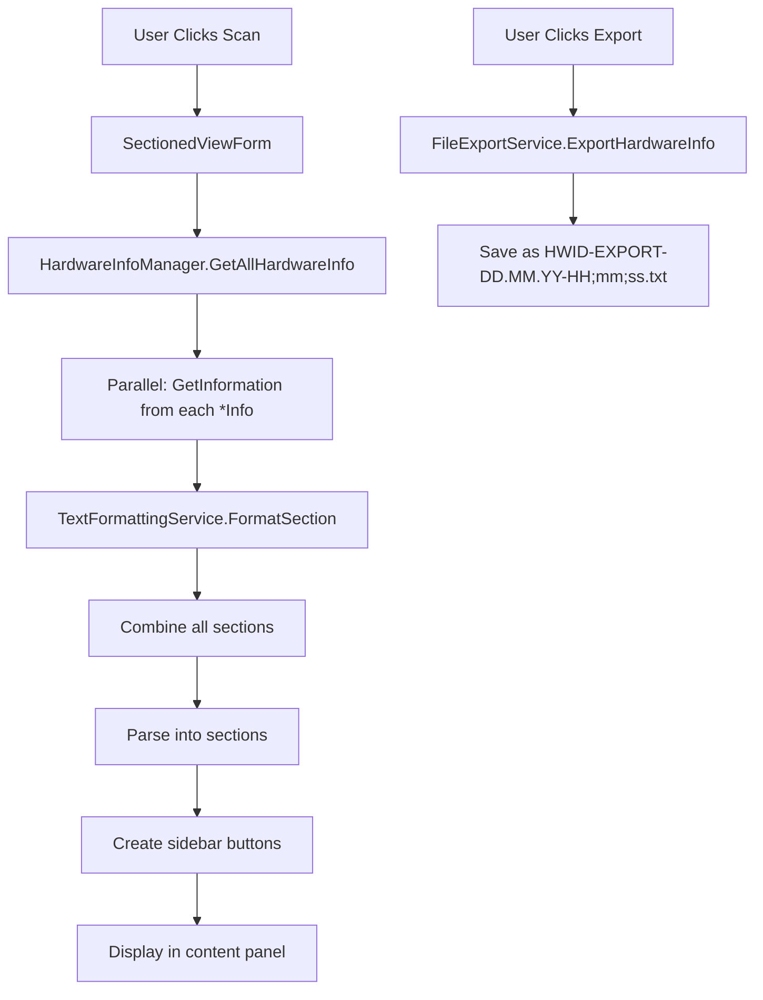

# AI-README: HWID Checker Architecture Index

> **READ THIS FIRST** - This file is the authoritative guide for AI-assisted code modifications.
> WE USE THIS BUILD COMMAND ALWAYS: dotnet publish "HWID-Checkers/Software-Project/source/HWIDChecker.csproj" -c Release

---

## ⚠️ UNUSED FILES (Safe to Delete)

| File | Reason |
|------|--------|
| `UI/Forms/MainForm.cs` | **UNUSED** - Old main form, replaced by `SectionedViewForm` |
| `UI/Forms/MainFormLayout.cs` | **UNUSED** - Layout for old MainForm |
| `UI/Forms/MainFormEventHandlers.cs` | **UNUSED** - Event handlers for old MainForm |
| `UI/Forms/MainFormLoader.cs` | **UNUSED** - Loader for old MainForm |
| `UI/Forms/MainFormInitializer.cs` | **UNUSED** - Initializer for old MainForm |
| `UI/Forms/MainForm.resx` | **UNUSED** - Resource file for old MainForm |
| `UI/Components/CompareFormLayout.cs` | **UNUSED** - Never instantiated anywhere |
| `UI/DataHandlers/HardwareDataHandler.cs` | **UNUSED** - Base class for unused handlers |
| `UI/DataHandlers/HardwareDataHandlerFactory.cs` | **UNUSED** - Factory never instantiated |
| `UI/DataHandlers/NetworkInfoHandler.cs` | **UNUSED** - Handler never used |
| `UI/DataHandlers/SystemInfoHandler.cs` | **UNUSED** - Handler never used |
| `UI/DPI/` | **UNUSED** - Empty directory |

---

## Quick Reference: Modification Patterns

| Task | Files to Modify | Key Classes |
|------|----------------|-------------|
| Add new hardware info type | `Hardware/*Info.cs`, `HardwareInfoManager.cs` | `IHardwareInfo` |
| Add property to existing hardware | `Hardware/*Info.cs` | Specific info class |
| Change text formatting | `TextFormattingService.cs` | `TextFormattingService` |
| Add UI button/handler | `SectionedViewForm.cs` | `SectionedViewForm` (buttons created inline) |
| Add export format | `FileExportService.cs` | `FileExportService` |

---

## Architecture Overview

```
┌─────────────────────────────────────────────────────────────────────┐
│                           Program.cs                                 │
│                           (Entry Point)                              │
└──────────────────────────────┬──────────────────────────────────────┘
                               │
                               ▼
┌─────────────────────────────────────────────────────────────────────┐
│                     SectionedViewForm.cs                            │
│              (MAIN UI - Sidebar + Content + Buttons)                │
└──────┬──────────────────────────────────────────────────┬───────────┘
       │                                                  │
       ▼                                                  ▼
┌─────────────────────┐                        ┌─────────────────────┐
│ HardwareInfoManager │                        │   Services Layer    │
│  (Orchestrator)     │                        │                     │
└──────┬──────────────┘                        │ • TextFormatting    │
       │                                       │ • FileExport        │
       │                                       │ • DeviceCleaning    │
       │                                       │ • DeviceCleaning    │
       │                                       │ • AutoUpdate        │
       ▼                                       └─────────────────────┘
┌─────────────────────────────────────────────────────────────────────┐
│                     Hardware Providers                               │
│              (Implement IHardwareInfo)                               │
│                                                                     │
│ DiskDriveInfo, CpuInfo, GpuInfo, BiosInfo,                         │
│ MotherboardInfo, RamInfo, TpmInfo, UsbInfo,                        │
│ MonitorInfo, NetworkInfo, ArpInfo                                  │
└─────────────────────────────────────────────────────────────────────┘
```

---

## Core Contracts

### IHardwareInfo Interface
**Location:** `Hardware/IHardwareInfo.cs`

All hardware info classes must implement:
```csharp
string GetInformation();     // Returns raw data string
string SectionTitle { get; } // Display title for UI
```

---

## File Responsibilities

### Hardware Layer (`Hardware/`)

| File | Purpose | Dependencies |
|------|---------|-------------|
| `HardwareInfoManager.cs` | **ORCHESTRATOR** - Combines all hardware providers, runs parallel collection | All `*Info.cs`, `TextFormattingService` |
| `IHardwareInfo.cs` | Contract for all hardware providers | None |
| `DiskDriveInfo.cs` | Collects disk drive info (model, serial, firmware, volumes) | `TextFormattingService`, WMI |
| `CpuInfo.cs` | Collects CPU info (name, processor ID, serial) | `TextFormattingService`, WMI |
| `BiosInfo.cs` | Collects BIOS/SMBIOS info (manufacturer, version, UUID) | `TextFormattingService`, WMI |
| `MotherboardInfo.cs` | Collects motherboard info (product, serial, manufacturer) | `TextFormattingService`, WMI |
| `RamInfo.cs` | Collects RAM info (capacity, speed, device locator) | `TextFormattingService`, WMI |
| `GpuInfo.cs` | Collects GPU info (name, device ID, driver version) | `TextFormattingService`, WMI |
| `TpmInfo.cs` | Collects TPM info (version, manufacturer) | `TextFormattingService`, WMI |
| `UsbInfo.cs` | Collects USB device info (device ID, description) | `TextFormattingService`, WMI |
| `MonitorInfo.cs` | Collects monitor info (name, serial, product code) | `TextFormattingService`, WMI |
| `NetworkInfo.cs` | Collects network adapter info (MAC, adapter type, driver) | `TextFormattingService`, WMI |
| `ArpInfo.cs` | Collects ARP table info (IP, MAC, interface) | `TextFormattingService`, WMI |

### Services Layer (`Services/`)

| File | Purpose | Dependencies |
|------|---------|-------------|
| `TextFormattingService.cs` | **FORMATTER** - Formats all output text (headers, sections, separators) | None |
| `FileExportService.cs` | Exports hardware data to timestamped TXT files | None |
| `DeviceCleaningService.cs` | Scans and removes ghost (non-present) devices | `SetupApi` (Win32) |
| `SystemCleaningService.cs` | Wrapper for async device cleaning operations | `DeviceCleaningService` |
| `DeviceWhitelistService.cs` | Manages device whitelist for cleaning | None |
| `EventLogCleaningService.cs` | Cleans Windows event logs | None |
| `AutoUpdateService.cs` | Checks GitHub for updates and auto-updates exe | `System.Text.Json` |

### Services - Subdirectories

| Subdir | Purpose |
|--------|---------|
| `Models/` | Data models (`DeviceDetail`) |
| `Win32/` | Native Windows API P/Invoke declarations (`SetupApi`) |

### UI Layer (`UI/`)

| File | Purpose | Dependencies |
|------|---------|-------------|
| `Forms/SectionedViewForm.cs` | **MAIN UI** - Sidebar navigation + content display + all buttons | `HardwareInfoManager`, `FileExportService`, `AutoUpdateService` |
| `Forms/CleanDevicesForm.cs` | Ghost device cleaning UI | `SystemCleaningService`, `DeviceWhitelistService` |
| `Forms/CleanLogsForm.cs` | Event log cleaning UI | `EventLogCleaningService` |
| `Forms/WhitelistDevicesForm.cs` | Device whitelist management UI | `DeviceWhitelistService` |
| `Forms/DeviceRemovalConfirmationForm.cs` | Confirmation dialog for device removal | None |
| `Components/Buttons.cs` | Button styling utilities | None |
| `Components/ThemeColors.cs` | Color constants for dark theme | None |

**UNUSED FILES (See top of file):**
- `Forms/MainForm.cs`, `MainFormLayout.cs`, `MainFormEventHandlers.cs`, `MainFormLoader.cs`, `MainFormInitializer.cs`, `MainForm.resx`
- `DataHandlers/HardwareDataHandler.cs`, `HardwareDataHandlerFactory.cs`, `NetworkInfoHandler.cs`, `SystemInfoHandler.cs`
- `Components/CompareFormLayout.cs`
- `DPI/` (empty directory)

---

## Critical Workflows

### Adding a New Hardware Info Type

**Example: Adding `SoundCardInfo.cs`**

1. **Create the provider class** (`Hardware/SoundCardInfo.cs`):
   - Implement `IHardwareInfo`
   - Set `SectionTitle => "SOUND CARDS"`
   - Use WMI to query `Win32_SoundDevice`
   - Inject `TextFormattingService` in constructor
   - Return formatted string from `GetInformation()`

2. **Register in HardwareInfoManager** (`Hardware/HardwareInfoManager.cs`):
   - Add to `InitializeProviders()` list:
   ```csharp
   new SoundCardInfo(textFormatter)
   ```

### Adding a New Property to Existing Hardware

**Example: Adding "Temperature" to CPU info**

1. **Modify the info class** (`Hardware/CpuInfo.cs`):
   - Add WMI query for temperature (if available)
   - Append to output string

### Modifying Text Formatting

**Location:** `Services/TextFormattingService.cs`

- `FormatHeader()` - Main title formatting
- `FormatSection()` - Section header + content wrapper
- `AppendInfoLine()` - Single line: `Label: Value`
- `AppendCombinedInfoLine()` - Multi-column with ` | ` separator
- `AppendDeviceGroup()` - Multiple devices with separators

Constants at top:
- `LINE_WIDTH = 93` - Main separator width
- `ITEM_SEPARATOR_WIDTH = 40` - Item separator width

## Device Cleaning System

**Flow:**
1. `CleanDevicesForm` → `SystemCleaningService.ScanForGhostDevicesAsync()`
2. `SystemCleaningService` → `DeviceCleaningService.ScanForGhostDevices()`
3. `DeviceCleaningService` uses `SetupApi` (Win32) to enumerate devices
4. Filters out whitelisted devices (`DeviceWhitelistService`)
5. Shows confirmation dialog
6. Removes via `SetupDiRemoveDevice()`

**Win32 Integration:**
- `Services/Win32/SetupApi.cs` - P/Invoke declarations
- `SP_DEVINFO_DATA` struct - Device info structure
- `SetupDiGetClassDevs()` - Get device list
- `SetupDiEnumDeviceInfo()` - Enumerate devices
- `SetupDiGetDeviceRegistryProperty()` - Get device properties
- `SetupDiRemoveDevice()` - Remove device

---

## Auto-Update System

**Location:** `Services/AutoUpdateService.cs`

**Flow:**
1. Query GitHub API: `/repos/Fundryi/HWID-Privacy/commits?path=HWIDChecker.exe&per_page=1`
2. Compare commit timestamp with `HWIDChecker.exe` last modified time
3. If newer, download from: `/raw/main/HWIDChecker.exe`
4. Create batch script to replace exe
5. Restart application

**Dependency:** `System.Text.Json` for API response parsing

---

## Data Flow Diagram



---

## Important Constants & Config

| Location | Constant | Value | Purpose |
|----------|----------|-------|---------|
| `TextFormattingService.cs` | `LINE_WIDTH` | 93 | Main separator width |
| `TextFormattingService.cs` | `ITEM_SEPARATOR_WIDTH` | 40 | Item separator width |
| `SectionedViewForm.cs` | `ENABLE_DEBUG_BUTTON` | `true` | Show/hide debug button |
| `Program.cs` | Main form | `SectionedViewForm` | Entry point UI |

---

## When to Update This File

**Update AI-README.md when:**

1. Adding/removing hardware info types
2. Changing service layer contracts
3. Adding new UI forms or major UI restructuring
4. Modifying the data flow between layers
5. Adding new Win32 integrations or native API calls
6. Changing the auto-update mechanism

**DO NOT update for:**
- Bug fixes in existing code
- Minor UI tweaks
- Performance optimizations
- Code refactoring that doesn't change architecture

---

## Quick Start for AI

**Before making ANY changes:**

1. Read this file (`AI-README.md`)
2. Identify the modification pattern from the Quick Reference table
3. Read the relevant files listed in that pattern
4. Make changes to ALL files listed in the pattern
5. Test that the change works end-to-end

**Example Prompt:**
> "Read AI-README.md, then add a new property 'PowerState' to DiskDriveInfo. Update all necessary files according to the 'Add property to existing hardware' pattern."

---

## File Structure Summary

```
source/
├── Program.cs                          # Entry point
├── HWIDChecker.csproj                  # Project file
├── Hardware/
│   ├── IHardwareInfo.cs                # Interface
│   ├── HardwareInfoManager.cs          # ORCHESTRATOR
│   └── *Info.cs                        # 12 hardware providers
├── Services/
│   ├── TextFormattingService.cs        # FORMATTER
│   ├── FileExportService.cs            # Export to TXT
│   ├── DeviceCleaningService.cs        # Ghost device removal
│   ├── SystemCleaningService.cs        # Async wrapper
│   ├── DeviceWhitelistService.cs       # Whitelist management
│   ├── EventLogCleaningService.cs      # Log cleaning
│   ├── AutoUpdateService.cs            # GitHub updates
│   ├── Models/                         # Data models
│   └── Win32/                          # Native Windows API
└── UI/
    ├── Forms/
    │   ├── SectionedViewForm.cs         # MAIN UI (replaces old MainForm)
    │   ├── CleanDevicesForm.cs         # Device cleaning
    │   ├── CleanLogsForm.cs            # Log cleaning
    │   ├── WhitelistDevicesForm.cs     # Whitelist UI
    │   └── DeviceRemovalConfirmationForm.cs
    ├── Components/                     # Reusable UI components
    │   ├── Buttons.cs
    │   └── ThemeColors.cs
    └── DataHandlers/                   # UNUSED - See top of file
```

---

**Last Updated:** 2025-12-26
