# SSD Storage Privacy

> [!NOTE]
> **TL;DR:** Rewrites the controller-reported model, serial, and firmware of a supported SSD. The physical drive keeps working; the identifiers Windows, fingerprinting tools, and anti-cheats read change.
> Who reads it: Windows (`Win32_DiskDrive`, storage IOCTLs), any fingerprinting stack that enumerates disks, and anti-cheats that log drive identity.
> **Status:** the MAP1202 and YANSEN / KingSpec procedures were tested by the project owner on real hardware **[C]**. The SM2263XT and USB-bridge procedures are untested **[S]**.
> **Risk:** a mass-production tool can brick the drive or wipe it. Back up first.
> Changing serials and clearing SMART data voids the warranty on these drives.

## What a storage device can expose

Changing one value does not change every identifier below it. **[A]**

| Layer | Examples | What it identifies | Evidence |
|---|---|---|---|
| NVMe subsystem | Serial Number (SN), Model Number (MN) | The NVM subsystem. The NVMe specification assigns SN and MN at subsystem scope, not namespace scope. | **[A]** |
| NVMe controller or firmware domain | Controller ID, firmware revision | Controller ID distinguishes a controller within the NVM subsystem. Firmware revision reports the active firmware for the domain that contains the controller. | **[A]** |
| NVMe namespace | EUI-64, NGUID, Namespace UUID, namespace ID | A namespace exposed by the NVMe subsystem. EUI-64 is 8 bytes and NGUID is 16 bytes. A namespace ID is an access handle and is not the same as a persistent namespace identifier. | **[A]** |
| Windows storage views | Model, SerialNumber, FirmwareRevision, PNPDeviceID, UniqueId | Values exposed through the active Windows driver, storage provider, and transport. `UniqueId` is a selected storage identifier, not a synonym for every device identifier. | **[A]** |
| USB storage bridge | USB/SCSI product strings and bridge serial | The enclosure or bridge. This can replace or obscure the identity Windows sees while the SSD is connected through USB. It does not reprogram the SSD itself. | **[A]** for the separate bridge identity; **[CC]** for pass-through differences between bridge firmware versions |
| Disk layout | GPT disk GUID or MBR signature, partition GUIDs | The current partition layout on the media | **[A]** |
| Formatted volume | Windows volume serial number | The formatted file-system volume, not the manufacturer's drive serial | **[A]** |
| Health telemetry | ATA SMART or the NVMe SMART / Health Information log | Wear, errors, temperature, usage counters, and other health data. It is not one substitute drive serial. | **[A]** for NVMe; **[CC]** for ATA SMART |

The NVMe specification defines SN and MN for the NVM subsystem. A Controller ID identifies a controller within that subsystem. EUI-64, NGUID, and Namespace UUID identify namespaces. Windows exposes separate views: `Win32_DiskDrive` includes model, serial, firmware revision, and PnP device ID, while `IOCTL_STORAGE_QUERY_PROPERTY` can return identifiers supplied by the storage stack. **[A]**

NVMe 2.1 requires every namespace to expose at least one persistent namespace identifier: EUI-64, NGUID, or Namespace UUID. Windows protocol-specific storage queries can return the Identify Controller and Identify Namespace data. **[A]** This is a version-specific requirement. Older devices and USB bridges may not return all three fields, and a namespace ID (an access handle) or an empty bridge view does not count as one.

The Windows volume serial is assigned when a volume is formatted. Formatting, repartitioning, or changing a volume serial therefore does not rewrite the manufacturer-assigned drive serial. **[A]**

## Which controller do I have?

1. Run [HWIDChecker.exe](/HWIDChecker.exe) and save the complete **DISK DRIVES** section before changing hardware. The current source records the Windows-visible model, serial, firmware, hardware ID, storage UniqueId, partition identity, and volume serial. **[A]**
2. Search the exact drive model and hardware revision on the manufacturer's site. Treat third-party controller databases as a lead, not proof. The same retail model may ship with different internal parts. **[CC]**
3. If the controller package is already visible, compare its complete printed part number with the controller manufacturer's documentation. Do not infer a controller from the retail SSD name alone. **[CC]**
4. If a label or heatsink hides the package, stop. Do not heat, peel, or probe a drive for this guide. **[CC]**
5. Match both the controller and NAND type before choosing an MP tool. A controller match alone does not prove that a firmware package supports the installed NAND. **[CC]**

> [!WARNING]
> Do not test an MP package just because the drive model appears in a forum post. Record the controller marking, NAND marking or verified flash-ID result, board revision, current firmware, and capacity first. A wrong NAND profile can make the drive unusable. **[CC]**

## Hardware that works

| Controller / drive | Tool | Storage | Status | Where to buy |
|---|---|---|---|---|
| Maxio MAP1202 (M.2 NVMe) | MXMPTool MAP1202 USB | Controller flash | Tested by the owner **[C]** | [Priventive 512GB](https://priventive.de/products/priventive-m2-nvme-512-gb), [Priventive 1TB](https://priventive.de/products/kopie-von-priventive-m-2-nvme-2280-m-key-1-tb-nulled-serials-no-hwid), [Priventive 2TB](https://priventive.de/products/priventive-m-2-nvme-2280-m-key-2-tb-nulled-serials-no-hwid). **10% coupon** for priventive.de: `HWIDZERO`. This coupon is not an affiliate coupon, you get the max out of it. |
| Maxio MAP1202, other retail SSDs | MXMPTool MAP1202 USB | Controller flash | Not tested by the owner | [Fanxiang S500 NVMe (manufacturer link)](https://www.fanxiangssd.com/products/internal-solid-state-drive-fanxiang-s500-nvme-ssd-pcle?variant=45220228399421), [ssd-tester.de list of SSDs](https://ssd-tester.de/top_ssd.php) (Ctrl+F `MAP1202`, then choose) |
| YANSEN / KingSpec (2.5-inch SATA) | SSDToolKits.exe over an ASMT 2115 SATA-to-USB bridge | Controller flash | Tested by the owner **[C]** | [Priventive 1TB](https://priventive.de/products/priventive-1-tb-nulled-serials-no-hwid-changeable-serials), [Priventive 2TB](https://priventive.de/products/priventive-2-tb-nulled-serials-no-hwid-changeable-serials), [Priventive 4TB](https://priventive.de/products/priventive-4-tb-nulled-serials-no-hwid). **10% coupon**: `HWIDZERO`. KingSpec alternative: [Amazon SSD link](https://www.hagglezon.com/en/s/https%3A%2F%2Fwww.amazon.de%2F-%2Fen%2FKingSpec-Internal-Compatible-Desktop-Laptop%2Fdp%2FB0B2K3ZCHH%3Fth%3D1) |
| Silicon Motion SM2263XT (M.2 NVMe) | SM2263XT MP packages | Controller flash | Untested **[S]** | No bundled link; match controller and NAND first |

> [!NOTE]
> The spoofer guide includes info on what SSD chips work and where you can buy them.
> A matching retail model name is not enough. Vendors can change the controller or NAND between production batches. **[CC]**
> The external KingSpec note names `SSDToolKits.exe` and an ASMT 2115 SATA-to-USB bridge, but does not identify the SSD controller or NAND. The owner's **[C]** result applies to the YANSEN / KingSpec hardware and bridge they used. Compatibility of the linked KingSpec listing, replacement stock, and other production batches is unverified. **[S]**

## M.2 SSD SPOOFING

**Status:** tested by the project owner on real hardware (MAP1202). **[C]** No public controller manual exists for it, so follow the steps exactly.

Before the first step, write down the drive's current model, firmware, and serial (HWIDChecker export, or the tool's own readout). The current values are your revert target: if the new identity ever causes problems, you can restore the original values exactly.

> [!CAUTION]
> The project owner confirmed this procedure on real hardware, but it has not been independently repeated. Assume it destroys all data on the SSD. Back up and verify the backup first. Do not continue if the tool reports a different controller, capacity, or NAND configuration than expected.

### Prerequisites

- A compatible SSD (needs a `Maxio MAP1202 Controller`). See [Hardware that works](#hardware-that-works) for tested drives and where to buy them.
- Required:
  - **[M2_SERIAL_CHANGE_TOOL.zip](./m2-nvme/M2_SERIAL_CHANGE_TOOL.zip)**
  - **[USB-to-M.2 Adapter](https://priventive.de/products/m2-usb-adapter)**
    - <details>
       <summary>A USB-to-M.2 Adapter (expand to see picture)</summary>
      Try to look for a "JMicron JMS583" chipset.

      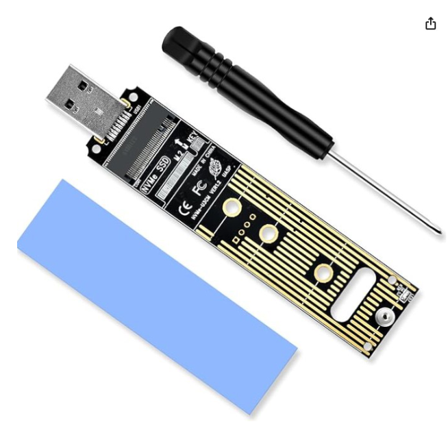

       </details>
- Optional:
  - **[HWIDChecker.exe](/HWIDChecker.exe)** (recommended for the before/after comparison)
  - **A secondary PC** with no anti-cheat installed
    - This is optional; you can use it on your main PC, just no anti-cheat open/installed.

### Instructions

1. **Plug the M.2 into a USB adapter.**
   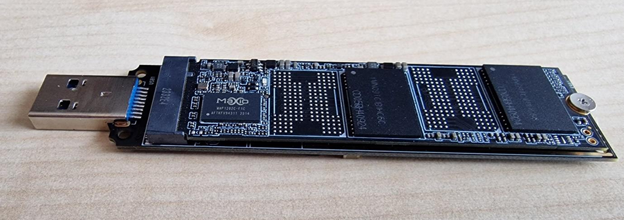

2. **Connect the USB adapter to your SECOND PC** (make sure **no anti-cheat** is installed).
   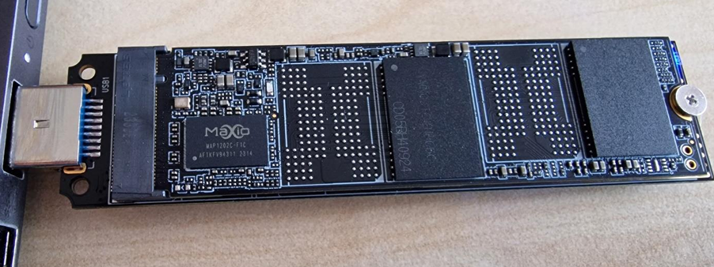

3. **Open the MXMPTool_MAP1202_USB_V0_01_009d.exe** (previously downloaded from the link in Prerequisites).

4. **Go to "Test items".**
   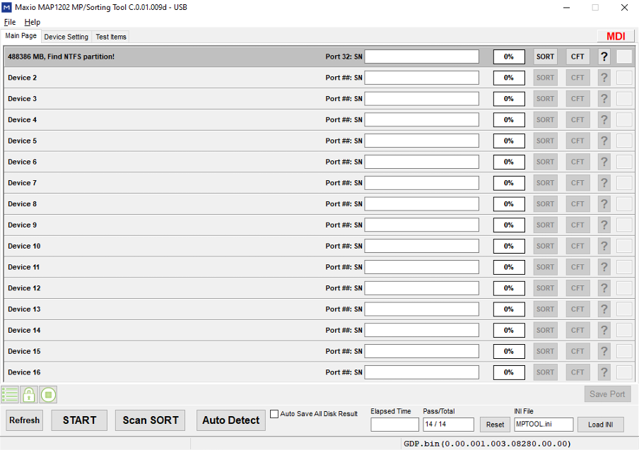
   Configure it as shown in the image above.

5. **Next, go to "Device Setting".**
   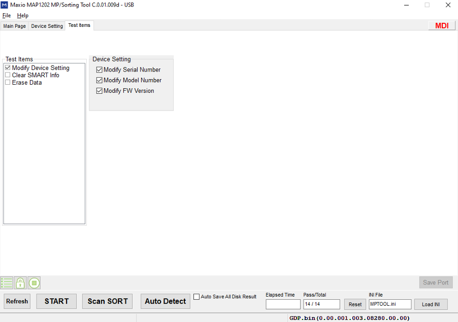

6. **Enter the following details** (follow the recommended format):

   - **Firmware Version**: use **only numbers**.
   - **Model Number**: use **only letters and numbers**, up to a maximum of **20 characters**.
   - **Preferred Serial Number**: must match **TARGET SN LENGTH** (default is **13**).

7. **Return to the "Main Page"** of the tool.

8. **Click "Start"** to begin the spoofing process.

9. **Check the first port** in the tool.

   - When it turns **green**, the process has **completed successfully**.
     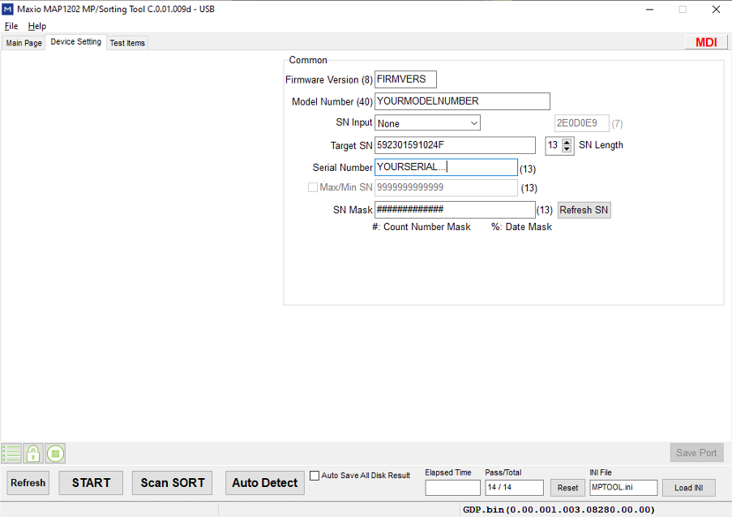

10. **Unplug the USB adapter** from the PC.

11. **Shutdown** your **MAIN PC**.

12. **Unplug** your **MAIN PC** **completely** (remove the power cable).

13. **Reinstall** the **M.2 SSD** back into the **M.2 slot** of your **MAIN PC**.

14. **Power on** your **MAIN PC**.

15. **Open** [HWIDChecker.exe](/HWIDChecker.exe).

16. **Verify** that your **Model Name**, **Firmware Version**, and **Serial Number** have been updated.

## Silicon Motion SM2263XT notes

**Status:** untested by this project. **[S]**

Silicon Motion documents the SM2263XT hardware as a DRAM-less PCIe Gen3 x4, NVMe 1.3 controller with four NAND channels and Host Memory Buffer support. **[A]** The controller-specific programming workflow below comes from one external community guide and has not been reproduced by this project. **[S]**

> [!CAUTION]
> Every step in this subsection is untested and graded **[S]**. The available SM2263XT MP packages are unofficial factory tools. They may contain unsigned drivers, wipe the drive, or permanently damage it. Use an isolated test system, scan downloads, keep the target drive empty, and never install an unknown storage driver on a production machine.

1. Boot Windows from a different physical drive. The target NVMe must not be the active system disk while its firmware is being serviced.
2. Confirm the controller marking and determine the exact NAND generation. A controller-specific flash-identification utility and driver may be required, but their binaries are unvalidated and are not redistributed here.
3. Select an MP package that explicitly matches both `SM2263XT` and the detected NAND family. The external report describes packages grouped by NAND type, but a package from one SSD maker may still be incompatible with another board design.
4. Enter ROM mode only with pads documented for the exact PCB revision. Power the system off before making any connection. Never short random pads. The wrong pads can electrically damage the SSD or host.
5. In the MP utility, compare its NAND auto-detection with the independent result from step 2 before writing anything. Stop on any mismatch.
6. If the matched utility exposes them, configure the model, serial range or mask, firmware string, IEEE OUI, and extension identifier. Do not use blank or all-zero identifiers. In the reported SM2263XT case, the OUI plus extension identifier produced the namespace EUI-64, but that mapping is not proven for every firmware build.
7. Save the configuration, reopen it, and verify every value before starting the write. Do not interrupt power during programming.
8. After the utility reports success, shut down fully, remove power, reinstall the drive normally, recreate partitions if required, and compare every identifier listed in [Verify the result](#verify-the-result).

## Research candidates

**Status:** not guide-supported. Bring-up confirmed **[C]**; identity persistence unverified **[S]**.

These controllers have public evidence that an MP tool brought a drive up. None has a published before/after native NVMe capture of a chosen SN and MN, followed by reboot and cold-boot readback. Until that exists, they stay out of [Hardware that works](#hardware-that-works).

| Controller | NAND | Tool | Evidence |
|---|---|---|---|
| Maxio MAP1602 | YMTC X3-9070 | `MXMPTool_MAP1602` | Bring-up confirmed **[C]**. Serial and model settings reported **[S]**. Identity persistence unverified |
| Silicon Motion SM2269XT | Micron B47R; YMTC X2-9060 / TAS packages listed | `SM2269XT_MPTool_ADATA.exe` | B47R bring-up confirmed **[C]**. Model and SN fields reported **[S]**. Identity persistence unverified |
| InnoGrit IG5236 | YMTC X2-9060 | IG5236 MPUtility | Recovery only: 2 GB recovery mode back to full capacity **[C]**. No serial or model editing shown |

Realtek NVMe controllers (RTS5765, RTS5766DL) and Phison E13, E18, E19, E21, and E26 are not supported for identity change. No inspectable identity-change and cold-boot readback was found, and current Phison cases show firmware or NAND mismatch and failures. **[S]**

## USB NVMe enclosures and bridge serials

**Status:** untested by this project. **[S]**

The Sabrent EC-SNVE is a USB enclosure for M.2 NVMe and SATA drives. Sabrent's FAQ spells its bridge `RTL92108B`. Realtek's official catalog documents an `RTL9210B-CG` dual-protocol bridge. Because those names do not exactly match, confirm the chip or firmware dump instead of inferring the exact revision from the product page. **[A]**

One community repository contains RTL9210 configuration examples with separate `MANUFACTURE`, `PRODUCT`, `SCSI_VENDOR`, `SCSI_PRODUCT`, and `SERIAL` fields. Whether a changed `SERIAL` becomes the value Windows reports depends on the enclosure firmware and transport and is not verified here. **[S]**

Programming a USB bridge is different from programming the SSD. A bridge configuration change does not prove that the SSD's native NVMe SN, EUI-64, NGUID, firmware, or SMART / Health data changed. Verify the drive once through the enclosure and again in a native M.2 slot. **[A]**

A vendor-documented example: TI's TUSB926x Flash Burner documentation supports editing the USB descriptors and the device serial of that bridge. It changes the bridge identity only, not the drive behind it. **[A]**

> [!CAUTION]
> The bridge-flashing procedure below is untested by this project and graded **[S]**. Flashing the wrong RTL9210A/RTL9210B firmware or another enclosure's configuration can disable USB access. Preserve a full factory dump before changing anything.

1. Confirm the exact EC-SNVE hardware revision and record the controller name and firmware from its current dump. Similar names and USB IDs do not prove identical boards.
2. Save the complete factory firmware and configuration dump in two locations.
3. Start from the configuration dumped from that enclosure. Change only the intended bridge identity field. Do not copy PHY, power, LED, PCIe, or SATA settings from an unrelated enclosure.
4. Use a firmware tool and package intended for that exact RTL9210B enclosure revision. Keep power stable until the write and verification finish.
5. Reconnect the enclosure and compare its USB/SCSI identity in HWIDChecker. Then install the SSD directly in an M.2 slot and compare the native NVMe identity. If only the USB result changed, you changed the bridge, not the SSD.

## NORMAL 2.5' SSD SPOOFING

**Status:** tested by the project owner on real hardware (YANSEN / KingSpec). **[C]** No public controller manual exists for it, so follow the steps exactly.

Before the first step, write down the drive's current model, firmware, and serial (HWIDChecker export, or the tool's own readout). The current values are your revert target: if the new identity ever causes problems, you can restore the original values exactly.

> [!CAUTION]
> The project owner confirmed this procedure on real hardware, but it has not been independently repeated. Assume that pressing **Update** can erase the SSD or make it inaccessible. Back up and verify the backup first. Confirm both the SSD controller and the ASMT 2115 bridge before continuing.

### Prerequisites

- A compatible SSD (manufacture `YANSEN`). See [Hardware that works](#hardware-that-works) for tested drives and where to buy them.
- Required:
  - **[SSD_SERIAL_CHANGE_TOOL.zip](./sata-25/SSD_SERIAL_CHANGE_TOOL.zip)**
  - **A SATA-to-USB with ASMT 2115 chipset**
- Optional:
  - **[HWIDChecker.exe](/HWIDChecker.exe)** (recommended for the before/after comparison)
  - **A secondary PC** with no anti-cheat installed
    - This is optional; you can use it on your main PC, just no anti-cheat open/installed.

### Steps to Follow

1. Plug the SSD into a USB adapter.
   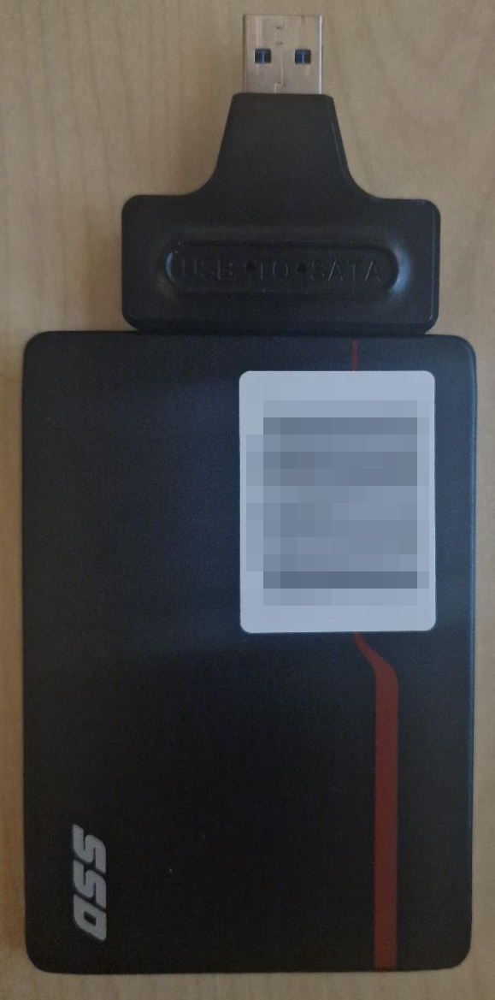

2. Plug the USB adapter into your SECOND PC (**no anti-cheat should be installed**).
   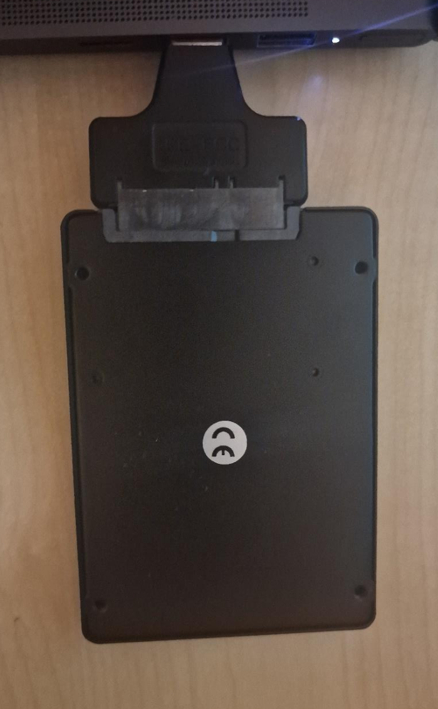

3. **Open the SSDToolKits.exe** (previously downloaded from the link in Prerequisites).

4. Check the **top dropdown** to see if your SSD is detected. If not, redo all previous steps.
   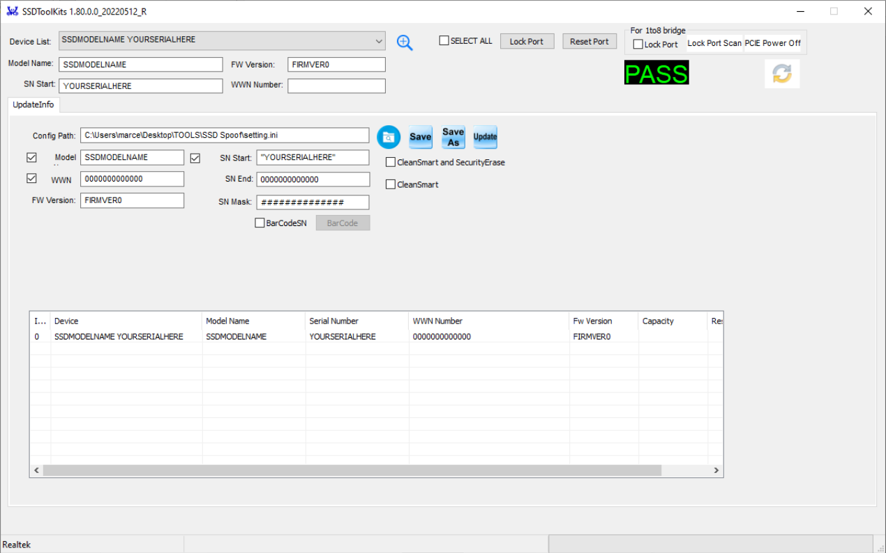

5. Set your preferred information as follows:

   - **Firmware Version**: use only numbers (FW Version).
   - **Model Name**: use only letters and numbers, max 20 characters.
   - **Serial Number**: maximum length is **TARGET SN LENGTH** (default: 13).
   - **WWN**: not needed, but you can edit.

6. Click **"Save"**.

7. Press **"Update"**.
   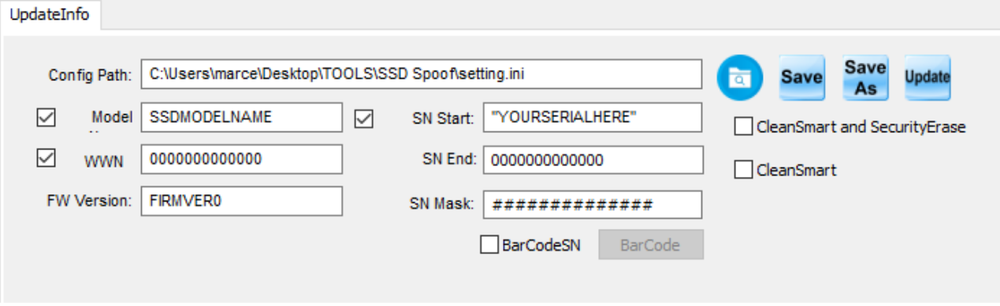

8. When the program shows **PASS** in the top right corner, everything succeeded.
   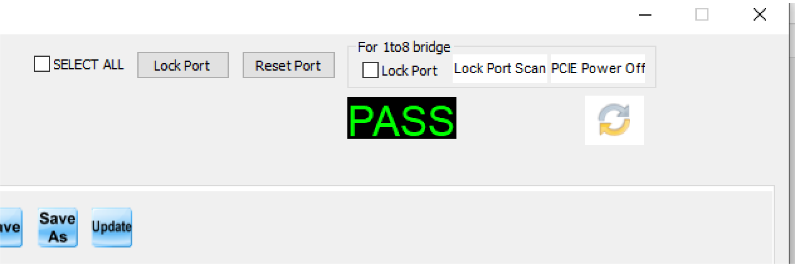

9. You should now see your updated **Model Name, Firmware Version, and Serial Number**.

10. **Unplug the USB adapter** from the PC.

11. **Shutdown** your **MAIN PC**.

12. **Unplug** your **MAIN PC** **completely** (remove the power cable).

13. **Reinstall** the **NORMAL SSD** back into your **MAIN PC**.

14. **Power on** your **MAIN PC**.

15. **Open** [HWIDChecker.exe](/HWIDChecker.exe).

16. **Verify** that your **Model Name**, **Firmware Version**, and **Serial Number** have been updated.

## RAID, disk identity, and volume identity

A RAID controller or Windows virtual-disk layer can present a logical or virtual disk with its own identity. Microsoft documents physical disks and virtual disks as separate storage objects. **[A]**

A hardware RAID subsystem exposes storage as logical units. Whether Windows can enumerate each member drive or its serial depends on the controller and storage provider. The controller's management interface may expose details that the normal Windows disk view does not. **[A]** for the logical-unit model; **[CC]** for controller-specific pass-through behavior.

Creating a Windows Storage Spaces virtual disk, changing the partition layout, or formatting a volume creates or changes identities at those layers. It does not by itself document a firmware change to member SSDs. Record and compare both the physical and virtual objects. **[A]**

A reported anti-cheat issue involved RAID 0; see the [Reported anti-cheat status](../getting-started/getting-started.md#reported-anti-cheat-status). Whether anti-cheats still read member serials through an array is reported both ways; the reports conflict and none includes a versioned test.

> [!NOTE]
> **Sampled EAC observation.** One hash-identified Rust/EOS driver sample contains machine-ID format strings for only these fields: MAC, MBR signature, partition number, and disk LUN. ([goldzik1 evidence](https://github.com/goldzik1/eac-eos-driver-analysis/blob/main/EVIDENCE.md)) This is a community reversing artifact **[S]**. It is not proof that EAC reads member-drive serials through RAID. It does not show every EAC integration, future builds, or server-side ban weights.

> [!NOTE]
> Software/BIOS-based RAID0 is generally virtual and unsafe for HWID evasion.

## Verify the result

Do not accept a green **PASS** indicator as proof by itself.

1. Before the change, open [HWIDChecker.exe](/HWIDChecker.exe), expand **DISK DRIVES**, and save or export the full result. **[A]**
2. Record the connection path: native M.2, direct SATA, USB bridge, or RAID controller. A transport change can change what Windows is able to query. **[A]**
3. After the change and a full power-off, capture the same view again. Compare these fields from HWIDChecker's current output. **[A]**
   - `Model`, `Serial`, and `Firmware`;
   - `Hardware ID`;
   - `UniqueId (IOCTL)` and `UniqueId (WMI)`, including decoded values;
   - GPT disk GUID or MBR disk signature and all partition GUIDs;
   - each `Volume-SN`.
4. For an NVMe drive, check whether the tool changed only the NVM subsystem SN or also the namespace EUI-64, NGUID, or UUID. An unchanged namespace identifier is not contradicted by a changed subsystem serial. **[A]**
5. For a USB enclosure, repeat the capture with the SSD connected natively. This separates a bridge serial change from a drive-firmware change. **[A]**
6. If a RAID layer is involved, capture both the operating-system virtual disk and the RAID controller's member-drive inventory. **[CC]**
7. Keep the before-and-after records private. They contain hardware identifiers. Never attach real values to a public issue or commit. **[A]**

HWIDChecker reports the identifiers that Windows exposes through WMI, the Windows Storage Management provider, SetupAPI, and storage IOCTLs. A blank field can mean that a driver, bridge, or controller did not pass that identifier through. It does not prove that the underlying device has no identifier. **[A]**

### Windows verification commands

Run these read-only PowerShell commands before and after the change. Use the same Windows installation and the same connection path for both captures. Save the output privately. **[A]**

```powershell
Get-CimInstance Win32_DiskDrive |
  Select-Object Index, Model, SerialNumber, FirmwareRevision, PNPDeviceID

Get-Disk |
  Select-Object Number, FriendlyName, SerialNumber, UniqueId, UniqueIdFormat, BusType, PartitionStyle, Guid, Signature

Get-PhysicalDisk |
  Select-Object FriendlyName, SerialNumber, FirmwareVersion, UniqueId, UniqueIdFormat, BusType

Get-VirtualDisk |
  Select-Object FriendlyName, UniqueId, ResiliencySettingName, HealthStatus
```

For each mounted volume, replace `C:` as needed and record its formatted-volume serial separately:

```powershell
cmd /c vol C:
```

`Get-PhysicalDisk` can return the highest-priority identifier supplied by the storage provider. It does not guarantee that every NVMe namespace identifier is visible. Empty or changed output after moving between native M.2, SATA, USB, or RAID paths may reflect transport behavior rather than a firmware change. **[A]**

## Sources

- [NVM Express Base Specification 2.0d](https://nvmexpress.org/wp-content/uploads/NVM-Express-Base-Specification-2.0d-2024.01.11-Ratified.pdf)
- [Microsoft: Win32_DiskDrive class](https://learn.microsoft.com/en-us/windows/win32/cimwin32prov/win32-diskdrive)
- [Microsoft: IOCTL_STORAGE_QUERY_PROPERTY](https://learn.microsoft.com/en-us/windows/win32/api/winioctl/ni-winioctl-ioctl_storage_query_property)
- [Microsoft: STORAGE_DEVICE_ID_DESCRIPTOR](https://learn.microsoft.com/en-us/windows/win32/api/winioctl/ns-winioctl-storage_device_id_descriptor)
- [Microsoft: IOCTL_DISK_GET_DRIVE_LAYOUT_EX](https://learn.microsoft.com/en-us/windows/win32/api/winioctl/ni-winioctl-ioctl_disk_get_drive_layout_ex)
- [Microsoft: MSFT_PhysicalDisk class](https://learn.microsoft.com/en-us/windows-hardware/drivers/storage/msft-physicaldisk)
- [Microsoft: MSFT_VirtualDisk class](https://learn.microsoft.com/en-us/windows-hardware/drivers/storage/msft-virtualdisk)
- [Microsoft: MSFT_Disk class](https://learn.microsoft.com/en-us/windows-hardware/drivers/storage/msft-disk)
- [Microsoft: GetVolumeInformationW](https://learn.microsoft.com/en-us/windows/win32/api/fileapi/nf-fileapi-getvolumeinformationw)
- [Silicon Motion: SM2263EN / SM2263XT product brief](https://www.siliconmotion.com/download/3bo/a/SM2263ENXT_PB_EN_201910.pdf)
- [Realtek: RTL9210B-CG product page](https://www.realtek.com/Product/Index?cate_id=786&id=4075&menu_id=384)
- [Sabrent EC-SNVE product page](https://sabrent.com/products/ec-snve)
- [Microsoft: Get-Disk](https://learn.microsoft.com/en-us/powershell/module/storage/get-disk)
- [Microsoft: Get-PhysicalDisk](https://learn.microsoft.com/en-us/powershell/module/storage/get-physicaldisk)
- [Microsoft: Get-VirtualDisk](https://learn.microsoft.com/en-us/powershell/module/storage/get-virtualdisk)
- [Microsoft: Diskraid hardware RAID model](https://learn.microsoft.com/en-us/windows-server/administration/windows-commands/diskraid)
- [Microsoft: vol command](https://learn.microsoft.com/en-us/windows-server/administration/windows-commands/vol)
- [HWID-Privacy: current Rust disk provider](../../app/rust/src/hw/disk/)
- [bensuperpc/rtl9210 community firmware and configuration reference](https://github.com/bensuperpc/rtl9210)
- [NVM Express Base Specification 2.1](https://nvmexpress.org/wp-content/uploads/NVM-Express-Base-Specification-Revision-2.1-2024.08.05-Ratified.pdf)
- [Microsoft: Working with NVMe drives](https://learn.microsoft.com/en-us/windows/win32/fileio/working-with-nvme-devices)
- [TI: TUSB926x Flash Burner user guide](https://www.ti.com/tw/lit/pdf/sllu125)
- [itho.cn: MAP1602 + YMTC X3-9070 build log](https://itho.cn/notes/616.html)
- [eefocus: MAP1602 serial, manufacturer, and capacity settings](https://www.eefocus.com/article/1890080.html)
- [flash.itho.cn: MAP1602 MP package catalog](https://flash.itho.cn/MPTool/Maxio/MAP1602/MAP1602-X3_9070-SN11296)
- [tfl-asp: SM2269XT 2230 B47R build](https://tfl-asp.github.io/2025/69xt/)
- [liangchanba: SM2269XT package and NAND list](https://club.liangchanba.com/thread-1696-1-1.html)
- [flashinfo: SM2269XT archive metadata (model and SN fields)](https://www.harbor.flashinfo.top/MPTool/Detail/1397)
- [Reddit r/ssd: IG5236 recovery report](https://www.reddit.com/r/ssd/comments/1uw4zq3/innogrit_ig5236_ant_esports_690_neo_ultra_1tb/)
- [InnoGrit: client SSD controllers](https://www.innogritcorp.com/ssdcontrollers/client/)
- [ZOL forum: Realtek MPTool tutorial](https://bbs.zol.com.cn/diybbs/d231_886908_back.html)
- [Elektroda: Phison E13T firmware mismatch example](https://www.elektroda.com/rtvforum/topic4182968.html)
- [goldzik1: EAC/EOS driver analysis evidence (community artifact)](https://github.com/goldzik1/eac-eos-driver-analysis/blob/main/EVIDENCE.md)
