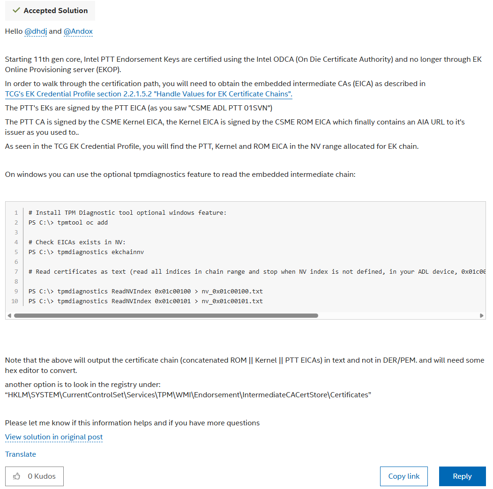

# TPM Spoofing Guide

> **Warning**: dTPM is flagged by some strict telemetry stacks (e.g., 🍊).
> **Current Recommendation**: Use **fTPM** for 🍊/🍒.
> Since 2025-04-04, 🍒 enforces **fTPM** if you're flagged; dTPM no longer works there.

---

## Table of Contents

- [fTPM Spoofing](#-ftpm-spoofing)
- [dTPM (Not Recommended)](#️-dtpm-not-recommended)

---

## ✅ fTPM Spoofing

- **Concept** (more complicated, and may be more relevant on AMD):
  - [fTPM Spoof PoC by cycript](https://github.com/cycript/FTPM_POC)
- **Simpler Working Method**:
  - **Requirements**:
    - Intel platform
    - Motherboard with:
      - Dedicated USB Flash port
      - BIOS Flash Button
        - Tested: MSI Z790
        - Should work with all Intel boards since the 11th-generation release, when the EK went offline.

  
Intel Forum Confirmation

  

  &#8203;

- **How it works**:
  - Check your motherboard manual for the exact flash procedure.
  - Place the BIOS file on the USB stick, then insert it into the designated flash USB port.
    - Each vendor has a different flash process; follow official documentation closely to avoid a bad flash.
  - Press the Flash Button and let it rewrite motherboard sectors.
  - This regenerates the fTPM seed
  - Results in a *new, unique fTPM serial* signed by EK
- **Note: Doesn't work on AMD boards**

---

## ⚠️ dTPM (Not Recommended)

- Buy a TPM module (e.g., from eBay)
- Plug into your motherboard's TPM header
- In BIOS:
  - Disable fTPM
  - Enable dTPM
