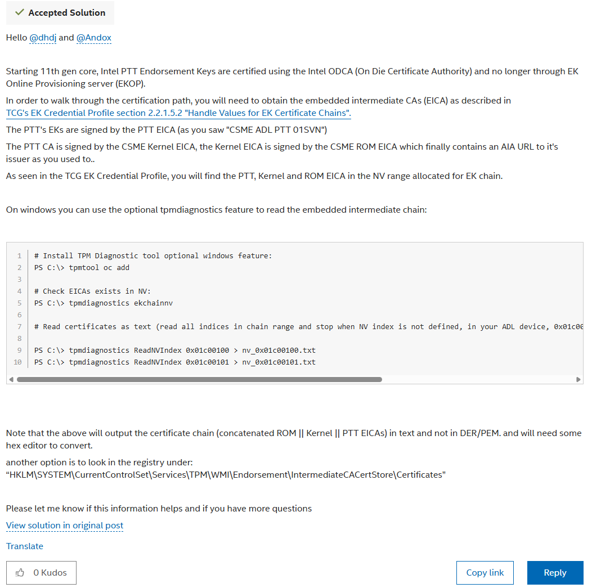

# TPM Spoofing Guide

> [!NOTE]
> **TL;DR:** The TPM carries its own endorsement identity (EK, EK certificate) that survives Windows reinstalls and TPM clears. This guide explains what that identity is, what changes it, and what does not.
> Who reads it: Windows, BitLocker, and any attestation-based check that validates the EK certificate chain.
> **Status:** identity model verified against TCG and Microsoft sources **[A]**. The fTPM flash-button method was tested on one MSI Z790 board **[C]**.
> **Warning**: dTPM support is product-specific. A faulty dTPM can fail attestation; FACEIT documents this and suggests fTPM as the fix. **[A]** Call of Duty's TPM requirements explicitly list systems with a discrete TPM chip as supported. **[A]** Blanket "dTPM is flagged" rules (e.g., 🍊) are community reports, not vendor statements. **[S]**
> **Current recommendation**: use **fTPM** for 🍊/🍒.

<details><summary>Older info (outdated)</summary>

> **Warning**: dTPM is flagged by some strict telemetry stacks (e.g., 🍊).
> Since 2025-04-04, 🍒 enforces **fTPM** if you're flagged; dTPM no longer works there.

</details>

Evidence grades appear inline. See [How to read these guides](../getting-started/getting-started.md#how-to-read-these-guides). **[A]** means verified against the linked specification, Microsoft documentation, vendor documentation, or this repository's source.

## Table of Contents

- [TPM identity and terminology](#tpm-identity-and-terminology)
- [TPM implementation types](#tpm-implementation-types)
- [What clearing the TPM changes](#what-clearing-the-tpm-changes)
- [Firmware updates and EK continuity](#firmware-updates-and-ek-continuity)
- [Inspect the TPM in Windows](#inspect-the-tpm-in-windows)
- [Verify with HWIDChecker.exe](#verify-with-hwidcheckerexe)
- [fTPM Spoofing](#-ftpm-spoofing)
- [dTPM (Not Recommended)](#️-dtpm-not-recommended)
- [Sources](#sources)

## TPM identity and terminology

TPM identity is a group of related keys and certificates, not one serial number. TPM 2.0 can reproduce more than one EK from the same Endorsement Primary Seed (EPS) when different standard templates or algorithms are used. For that reason, "the EK" is useful shorthand, but the exact key template still matters. **[A]** [TCG TPM 2.0 Library Part 1, version 185](https://trustedcomputinggroup.org/wp-content/uploads/Trusted-Platform-Module-2.0-Library-Part-1-Architecture_Version-185_pub.pdf) and [TCG EK Credential Profile 2.7](https://trustedcomputinggroup.org/wp-content/uploads/TCG-EK-Credential-Profile-for-TPM-Family-2.0-Level-0-Version-2.7_Pub.pdf)

| Term | What it means |
|---|---|
| **EPS** | The Endorsement Primary Seed. Standard EKs are deterministically created from this protected seed plus the requested template. The seed is not exported. **[A]** |
| **EK / EKpub** | An endorsement asymmetric key pair and its readable public half. The private half stays inside the TPM. The EK helps establish that another key belongs to a genuine TPM. **[A]** |
| **EK certificate (EKCert)** | An X.509 certificate issued by a TPM or platform manufacturer. It contains the public EK and statements about the TPM's provenance. It is separate from the EK and is not guaranteed to exist for every TPM. **[A]** |
| **EKpub hash** | A hash of the public EK. `Get-TpmEndorsementKeyInfo -HashAlgorithm Sha256` exposes it as `PublicKeyHash`. It is not a certificate serial or certificate thumbprint. **[A]** |
| **SPS / SRK** | The Storage Primary Seed and a Storage Root Key derived from it. This hierarchy protects operating-system and application keys. Changing storage state can invalidate those keys without changing the EPS or EK. **[A]** |
| **AIK / attestation key** | A signing identity used to report platform state without presenting the EK directly to every relying party. Windows can create multiple attestation identities for privacy separation. **[A]** |

The EK certificate chain, the EK public-key hash, a certificate serial, and an AIK are different identifiers. Record them separately. A changed value in one field does not prove that every TPM identity changed or that a relying party will trust the new state. **[A]** [How Windows uses the TPM](https://learn.microsoft.com/en-us/windows/security/hardware-security/tpm/how-windows-uses-the-tpm) and [TPM key attestation](https://learn.microsoft.com/en-us/windows-server/identity/ad-ds/manage/component-updates/tpm-key-attestation)

## TPM implementation types

| Type | Where it runs | Practical identity note |
|---|---|---|
| **dTPM** | A separate TPM 2.0 chip or plug-in module connected to the platform. | The component has its own endorsement identity. **[A]** Plug-in modules are board-specific, so follow the motherboard manual and do not assume modules are interchangeable. **[CC]** |
| **fTPM** | Firmware in a hardware-protected trusted execution environment on the platform SoC. | AMD calls its implementation **AMD fTPM**. Intel calls its implementation **Platform Trust Technology (PTT)**. **[A]** |
| **Pluton as TPM** | Microsoft Pluton integrated into supported processor silicon and configured as the system TPM. | It implements TPM 2.0 when selected. Beginning with newly introduced 2026 AMD and Qualcomm silicon, Pluton no longer serves as the TPM; earlier devices that shipped that way remain supported. **[A]** |

Windows uses the standard TPM interface for all three forms, so `tpm.msc` or `tpmtool` may not by itself prove the physical implementation. Confirm the active choice in the device or motherboard firmware documentation. **[A]** [Microsoft TPM recommendations](https://learn.microsoft.com/en-us/windows/security/hardware-security/tpm/tpm-recommendations), [Intel PTT overview](https://www.intel.com/content/www/us/en/support/articles/000094205/processors/intel-core-processors.html), and [Microsoft Pluton as TPM](https://learn.microsoft.com/en-us/windows/security/hardware-security/pluton/pluton-as-tpm)

## What clearing the TPM changes

A normal Windows TPM clear returns the TPM to an unowned state and invalidates keys created by the previous owner. Windows then initializes and takes ownership of it again. In TPM 2.0 terms, `TPM2_Clear` changes storage-hierarchy state, including the Storage Primary Seed. It does **not** call `TPM2_ChangeEPS`, so a standard clear does not by itself replace the Endorsement Primary Seed or the default EK derived from it. **[A]** [Microsoft TPM clear guidance](https://learn.microsoft.com/en-us/windows/security/hardware-security/tpm/initialize-and-configure-ownership-of-the-tpm) and [TCG TPM 2.0 Library Part 1](https://trustedcomputinggroup.org/wp-content/uploads/Trusted-Platform-Module-2.0-Library-Part-1-Architecture_Version-185_pub.pdf)

> [!CAUTION]
> Clearing can destroy TPM-created keys and access to data protected only by those keys. Save BitLocker recovery keys, suspend BitLocker protectors, and make sure a password or another sign-in method works first. Microsoft specifically lists sign-in PINs and virtual smart cards as affected. Hardware-backed Windows Hello passkeys also keep their private keys in the TPM, so prepare an alternate sign-in path before clearing. **[A]** [Microsoft clear precautions](https://learn.microsoft.com/en-us/windows/security/hardware-security/tpm/initialize-and-configure-ownership-of-the-tpm) and [Windows passkeys](https://learn.microsoft.com/en-us/entra/identity/authentication/how-to-authentication-entra-passkeys-on-windows)

For an ordinary Windows clear, Microsoft recommends using Windows Security or `tpm.msc`, not a direct UEFI clear. Do not clear a work or school device without its administrator's instructions. **[A]**

For the deeper AMD firmware-reset research and the generation-specific Intel findings, continue with the [fTPM Identity Reset Guide](../resets/ftpm-reset-tutorial.md).

## Firmware updates and EK continuity

The TPM 2.0 architecture requires a field-upgraded TPM to reproduce the original manufacturer-certified EK when the same template is supplied. This remains true even if the upgrade changes primary-seed strength or the algorithm that uses the seed. The requirement lasts until `TPM2_ChangeEPS` changes the Endorsement Primary Seed. A BIOS or TPM firmware version change alone is therefore not specification-level proof of a new standard EK. **[A]** [TCG TPM 2.0 Library Part 1, version 185](https://trustedcomputinggroup.org/wp-content/uploads/Trusted-Platform-Module-2.0-Library-Part-1-Architecture_Version-185_pub.pdf)

If a measured EKpub hash changes after a firmware update, record the exact template and algorithm, rule out stale or mismatched measurements, and validate the matching EK certificate. Treat any vendor-specific derivation explanation as unverified unless the vendor documents it.

## Inspect the TPM in Windows

Use an elevated terminal for the command-line checks:

```powershell
# Basic readiness, manufacturer and firmware information
tpmtool getdeviceinformation

# EK public-key hash and the certificate collections Windows knows about
Get-TpmEndorsementKeyInfo -HashAlgorithm Sha256 |
    Format-List IsPresent, PublicKeyHash, ManufacturerCertificates, AdditionalCertificates
```

`tpmtool getdeviceinformation` reports basic TPM state. `Get-TpmEndorsementKeyInfo` reports the endorsement public key and Windows certificate collections. `ManufacturerCertificates` and `AdditionalCertificates` are collections, so inspect every returned certificate rather than assuming there is exactly one. **[A]** [tpmtool reference](https://learn.microsoft.com/en-us/windows-server/administration/windows-commands/tpmtool) and [Get-TpmEndorsementKeyInfo reference](https://learn.microsoft.com/en-us/powershell/module/trustedplatformmodule/get-tpmendorsementkeyinfo?view=windowsserver2025-ps)

Open `tpm.msc` to confirm that Windows considers the TPM ready and to access the operating-system-managed clear workflow. The console is useful for state, but use the PowerShell output when you need the EKpub hash or certificate details. **[A]**

## Verify with HWIDChecker.exe

Run the repository-root `HWIDChecker.exe` before and after any approved change. How to run and export: [Take before and after snapshots](../getting-started/getting-started.md#take-before-and-after-snapshots). In **TPM MODULES**, record the enabled state, manufacturer, TPM version, specification version, SHA-256 hash, and any certificate serial, thumbprint, or issuer that appears. The Rust application first reads EK public-key and certificate fields through NCrypt/crypt32. Unsupported keys or ambiguous certificate sets fall back to `Get-TpmEndorsementKeyInfo`; that fallback reduces formatted output to one value per field and can overwrite values when more than one certificate is present. **[A]** [TPM provider](../../app/rust/src/hw/tpm.rs), [native EK wrapper](../../app/rust/src/win/tpm.rs)

Save the complete before-and-after output, but use the PowerShell certificate collections for the authoritative comparison. A changed SHA-256 hash with a missing or unchanged certificate is not enough to claim a trusted identity transition. Compare every certificate's serial, thumbprint, issuer, and chain separately, then follow the certificate checks in the [fTPM Identity Reset Guide](../resets/ftpm-reset-tutorial.md#check-your-certificate-after-any-rotation).

## ✅ fTPM Spoofing

**Status:** tested on MSI Z790 **[C]**. The claims that it should work on all Intel boards and that it regenerates the fTPM seed remain **[S]**.

- **Concept** (more complicated, and may be more relevant on AMD):
  - [fTPM Spoof PoC by cycript](https://github.com/cycript/FTPM_POC)
- **Simpler working method**:
  - **Requirements**:
    - Intel platform
    - Motherboard with:
      - Dedicated USB Flash port
      - BIOS Flash Button
        - Tested: MSI Z790
        - Other Intel boards from the 11th generation onward are untested. One MSI Z790 report only; the mechanism is unknown. Intel documents on-die EK certificate provisioning from CSME 15 (11th generation), not an offline EK. **[A]**
<details>
  <summary>Intel Forum Confirmation</summary>

  

</details>
  &#8203;

- **How it works**:
  - Check your motherboard manual for the exact flash procedure.
  - Place the BIOS file on the USB stick, then insert it into the designated flash USB port.
    - Each vendor has a different flash process; follow official documentation closely to avoid a bad flash.
  - Press the Flash Button and let it rewrite motherboard sectors.
  - Reported outcome: the fTPM seed regenerates
  - Reported outcome: a *new, unique fTPM serial*. The "signed by EK" description is not a verified mechanism.
- **Note**: doesn't work on AMD boards

<details><summary>Older info (outdated)</summary>

- Should work with all Intel boards since the 11th-generation release, when the EK went offline.
- This regenerates the fTPM seed
- Results in a *new, unique fTPM serial* signed by EK

</details>

> [!WARNING]
> The MSI Z790 result is **[C]** for that board only. Intel documents an on-die certificate-authority design for CSME 15 and later, not an "offline EK." Do not use this procedure on another board without board-specific evidence. See [Firmware updates and EK continuity](#firmware-updates-and-ek-continuity) and the [generation-specific Intel findings](../resets/ftpm-reset-tutorial.md#intel-z790-vs-z790-era-method-vs-z890).

## ⚠️ dTPM (Not Recommended)

- Buy a TPM module (e.g., from eBay)
- Plug into your motherboard's TPM header
- In BIOS:
  - Disable fTPM
  - Enable dTPM

## Sources

- [TCG TPM 2.0 Library specification index](https://trustedcomputinggroup.org/resource/tpm-library-specification/)
- [TCG TPM 2.0 Library Part 1: Architecture, version 185](https://trustedcomputinggroup.org/wp-content/uploads/Trusted-Platform-Module-2.0-Library-Part-1-Architecture_Version-185_pub.pdf)
- [TCG EK Credential Profile for TPM 2.0, version 2.7](https://trustedcomputinggroup.org/wp-content/uploads/TCG-EK-Credential-Profile-for-TPM-Family-2.0-Level-0-Version-2.7_Pub.pdf)
- [Microsoft: TPM fundamentals](https://learn.microsoft.com/en-us/windows/security/hardware-security/tpm/tpm-fundamentals)
- [Microsoft: How Windows uses the TPM](https://learn.microsoft.com/en-us/windows/security/hardware-security/tpm/how-windows-uses-the-tpm)
- [Microsoft: Troubleshoot and clear the TPM](https://learn.microsoft.com/en-us/windows/security/hardware-security/tpm/initialize-and-configure-ownership-of-the-tpm)
- [Microsoft: Get-TpmEndorsementKeyInfo](https://learn.microsoft.com/en-us/powershell/module/trustedplatformmodule/get-tpmendorsementkeyinfo?view=windowsserver2025-ps)
- [Microsoft: tpmtool](https://learn.microsoft.com/en-us/windows-server/administration/windows-commands/tpmtool)
- [Microsoft: TPM recommendations](https://learn.microsoft.com/en-us/windows/security/hardware-security/tpm/tpm-recommendations)
- [Microsoft: Pluton as TPM](https://learn.microsoft.com/en-us/windows/security/hardware-security/pluton/pluton-as-tpm)
- [Intel: Platform Trust Technology overview](https://www.intel.com/content/www/us/en/support/articles/000094205/processors/intel-core-processors.html)
- [Intel: CSME security technical white paper](https://www.intel.com/content/dam/www/public/us/en/security-advisory/documents/intel-csme-security-white-paper.pdf)
- [AMD: TPM reference-code impact on AMD fTPM](https://www.amd.com/en/resources/product-security/bulletin/amd-sb-7064.html)
