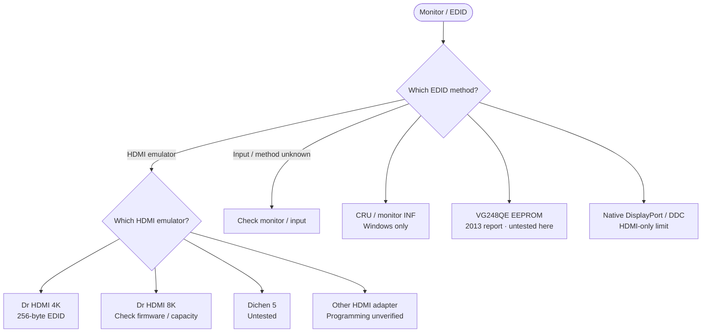

<!-- Generated from site/.vitepress/theme/journey-data.ts by site/scripts/journey-pages.mjs. Edit the metadata owner; review --json output and apply it explicitly. -->

# Monitor / EDID guide chooser

Choose Windows settings, an HDMI emulator or the monitor EEPROM. Keep the full EDID and signal features.

- **Identify:** [Identify EDID and the connection path](../../guides/monitor-spoofing/monitor-spoofing.md#how-monitor-identity-is-stored)
- **Prepare:** [Backup and recovery requirements](../../guides/monitor-spoofing/monitor-spoofing.md#requirements)
- **Full guide:** [Monitor and EDID identity](../../guides/monitor-spoofing/monitor-spoofing.md)
- **Verify:** [Verify identity and display features](../../guides/monitor-spoofing/monitor-spoofing.md#verify-with-hwidchecker)

## Choose your route

## Identify & prepare

- [Identify EDID / input](../../guides/monitor-spoofing/monitor-spoofing.md#how-monitor-identity-is-stored) (identification). **Complete descriptor and exact connection-path scope**
- [Prepare EDID](../../guides/monitor-spoofing/monitor-spoofing.md#prepare-a-safe-edited-edid) (preparation). **Capture, edit minimally and validate every descriptor block**

## Windows

- [CRU / INF override](../../guides/monitor-spoofing/monitor-spoofing.md#option-1-windows-software-override) (procedure). **Documented Windows override; driver / path support varies** Does not rewrite monitor hardware.
  Topic names: Windows EDID override: CRU / monitor INF.

## Inline HDMI

- [Dr HDMI 4K](../../guides/monitor-spoofing/monitor-spoofing.md#dr-hdmi-4k) (procedure). **Vendor mechanism; 256-byte capacity and signal fit required** Do not truncate a larger EDID to fit the device.
  Topic names: Dr HDMI 4K: programmable inline EDID.
- [Dr HDMI 8K](../../guides/monitor-spoofing/monitor-spoofing.md#dr-hdmi-8k) (procedure). **Vendor mechanism; firmware and complete EDID capacity required** Firmware 1.4 adds documented 384 / 512-byte support. Signal-feature support is a separate device requirement.
  Topic names: Dr HDMI 8K: firmware-dependent extended EDID.
- [Generic adapter limits](../../guides/monitor-spoofing/monitor-spoofing.md#generic-hdmi-edid-adapters) (limitation). **No generic programming model or software verified** Presets or sink copy do not establish user-programmable EDID.
  Topic names: Generic HDMI adapter: programming support unknown.
- [Dichen research](../../guides/monitor-spoofing/monitor-spoofing.md#dichen-5-programmable-fuser) (research). **Dichen-specific actions remain untested** Authoritative capacity, utility and recovery evidence is missing.
  Topic names: Dichen 5 / DC240HZ5D-2: untested research.

## Other paths

- [Direct EEPROM research](../../guides/monitor-spoofing/monitor-spoofing.md#option-4-direct-monitor-eeprom-modification) (research). **ASUS VG248QE 2013 third-party report; untested here** Does not establish another board revision, monitor model or DisplayPort path.
  Topic names: Direct EEPROM: exact monitor / input only.
- [DisplayPort / DDC limits](../../guides/monitor-spoofing/monitor-spoofing.md#ddc-ddcci-hdmi-and-displayport) (limitation). **HDMI-only emulation does not intercept native DisplayPort** Working DDC/CI controls do not establish EEPROM write access.
  Topic names: DisplayPort / DDC path: hardware boundary.

[Home](../home.md) · [Complete work order](../start.md) · [All hardware topics](../devices.md) · [Reference](../reference.md)
