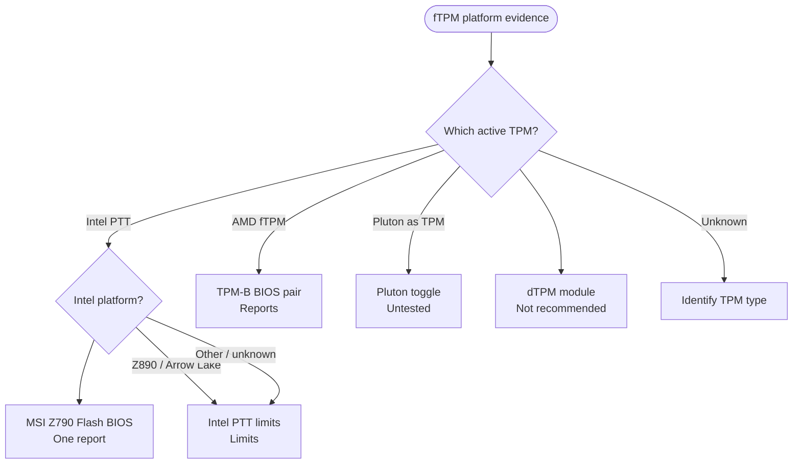

<!-- Generated from site/.vitepress/theme/journey-data.ts by site/scripts/journey-pages.mjs. Edit the metadata owner; review --json output and apply it explicitly. -->

# fTPM evidence guide chooser

Choose platform-specific reported evidence, then measure the active key, matching certificate and trust separately.

- **Identify:** [Identify the active TPM first](../../guides/tpm-spoofing/tpm-spoofing.md#tpm-implementation-types)
- **Prepare:** [Before any reset or TPM switch](../../guides/resets/ftpm-reset-tutorial.md#before-you-reset)
- **Full guide:** [fTPM reset evidence by platform](../../guides/resets/ftpm-reset-tutorial.md)
- **Verify:** [Check the active EK and certificate trust](../../guides/resets/ftpm-reset-tutorial.md#check-your-certificate-after-any-rotation)

## Choose your route

## Identify, prepare & measure

- [Identify active TPM](../../guides/tpm-spoofing/tpm-spoofing.md#tpm-implementation-types) (identification). **Implementation table; TPM chapter**
- [Before any reset](../../guides/resets/ftpm-reset-tutorial.md#before-you-reset) (preparation). **Recovery, alternate sign-in and paired baseline required**
- [Measure first](../../guides/resets/ftpm-reset-tutorial.md#measure-properly-or-you-will-fool-yourself) (verification). **Separate key, certificate and cached-view measurements** A persistent handle or certificate serial is not itself a trust test.

## AMD

- [TPM-B reports](../../guides/resets/ftpm-reset-tutorial.md#method-a-tpm-b-firmware-flash-cycle) (research). **Reported identity changes; post-rotation certificate unproven** A changelog or AMI prompt alone is not proof. Board rows without individual sources remain unverified.
  Topic names: AMD: TPM-B firmware flash-cycle reports.
- [Pluton research](../../guides/resets/ftpm-reset-tutorial.md#method-b-pluton-toggle-unverified) (research). **Overall procedure unverified; one displayed-key report** No demonstrated fresh trusted certificate or cross-board repeatability.
  Topic names: Pluton toggle: unverified research.

## Intel

- [Intel generation limits](../../guides/resets/ftpm-reset-tutorial.md#intel-z790-vs-z790-era-method-vs-z890) (limitation). **No verified Z890 rotation in cited 2026-08-21 research** Other Intel generations also land at the status section; this does not classify them as Z890. Shared href with tpm-intel.
  Topic names: Intel Z890 / Arrow Lake: no verified rotation.
- [MSI Z790 report](../../guides/tpm-spoofing/tpm-spoofing.md#-ftpm-spoofing) (research). **One MSI Z790 hardware report; TPM chapter** Other-board compatibility and the seed-regeneration explanation remain unverified.
  Topic names: Intel: MSI Z790 Flash BIOS Button report.

## Other paths & limits

- [dTPM substitution](../../guides/resets/ftpm-reset-tutorial.md#method-c-dtpm-module) (research). **Different chip identity; not recommended by the guide** Modules are board-specific. Read compatibility and attestation limits.
  Topic names: dTPM module: hardware substitution.
- [Reset / reinstall limits](../../guides/resets/ftpm-reset-tutorial.md#what-does-not-change-the-ek) (limitation). **Clear, settings reset and reinstall are not proven EK rotation** The source keeps standard-command facts, observations and confounded reinstall reports distinct.
  Topic names: Clear, CMOS reset or reinstall: rotation limits.

[Home](../home.md) · [Complete work order](../start.md) · [All hardware topics](../devices.md) · [Reference](../reference.md)
