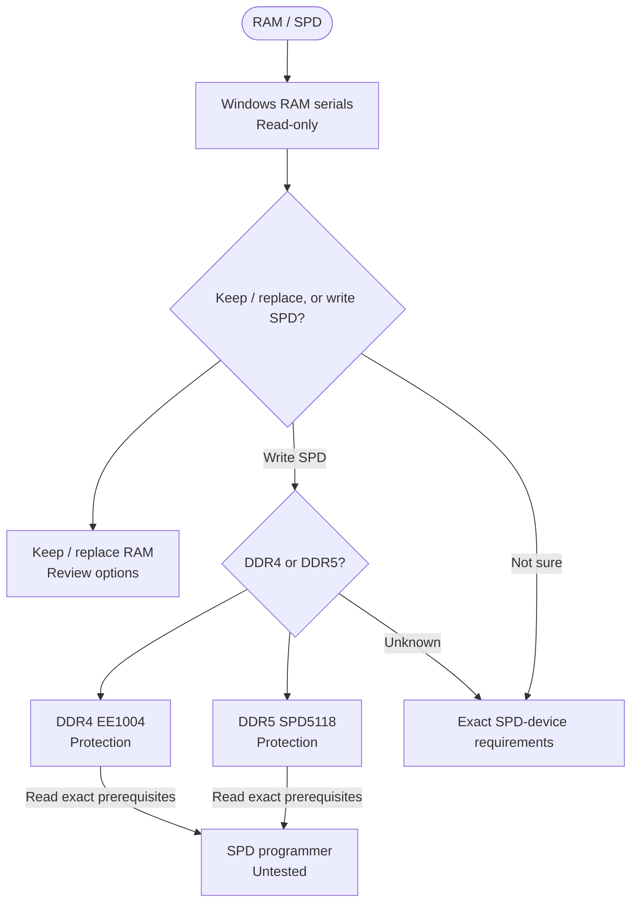

<!-- Generated from site/.vitepress/theme/journey-data.ts by site/scripts/journey-pages.mjs. Edit the metadata owner; review --json output and apply it explicitly. -->

# RAM / SPD guide chooser

Measure the chosen observation layer, review exact-module options, and treat programmer support and protection as prerequisites.

- **Identify:** [Identify modules in the read-only baseline](../../guides/ram-spoofing/ram-spoofing.md#read-only-baseline)
- **Prepare:** [Programmer and recovery requirements](../../guides/ram-spoofing/ram-spoofing.md#requirements)
- **Full guide:** [RAM modules and SPD identity](../../guides/ram-spoofing/ram-spoofing.md)
- **Verify:** [Verify SMBIOS and raw SPD readback](../../guides/ram-spoofing/ram-spoofing.md#verify-the-result)

## Choose your route

## Inspect & review options

- [Read-only baseline](../../guides/ram-spoofing/ram-spoofing.md#read-only-baseline) (identification). **Windows / SMBIOS view, not independent raw SPD**
- [Existing / replacement](../../guides/ram-spoofing/ram-spoofing.md#lowest-risk-options) (background). **Review options; measure the exact module in the chosen layer** A willingness to replace or one blank Windows field does not complete verification. Retail families are not a guarantee.
  Topic names: Existing null serial or module replacement.

## Before writing

- [DDR4 protection](../../guides/ram-spoofing/ram-spoofing.md#ddr4-ee1004-protection) (background). **Documented device protection; prerequisite, not a separate write route**
  Topic names: DDR4: EE1004 / AT34C04 protection.
- [DDR5 protection](../../guides/ram-spoofing/ram-spoofing.md#ddr5-spd5118-protection) (background). **Documented hub protection; prerequisite, not a separate write route** Offline-tester support is needed to clear protected block 8, not universally for an already writable block.
  Topic names: DDR5: SPD5118 hub and offline-tester support.
- [Programmer requirements](../../guides/ram-spoofing/ram-spoofing.md#requirements) (preparation). **Missing, failed or unsupported prerequisites are stop conditions**
  Topic names: Unknown generation, SPD device or protection.
- [Tools & support](../../guides/ram-spoofing/ram-spoofing.md#tools) (background). **Read-only views and DDR4 programmer example** The documented DDR4 example does not guarantee third-party-module or DDR5 support.
  Topic names: Tools: read-only views and DDR4 programmer example.

## Common external workflow

- [External workflow \[S\]](../../guides/ram-spoofing/ram-spoofing.md#external-programmer-procedure) (research). **Common external-programmer procedure untested** Requires exact device support, two matching full reads and external recovery. A read does not establish write permission.
  Topic names: External SPD programmer: untested write workflow.

[Home](../home.md) · [Complete work order](../start.md) · [All hardware topics](../devices.md) · [Reference](../reference.md)
