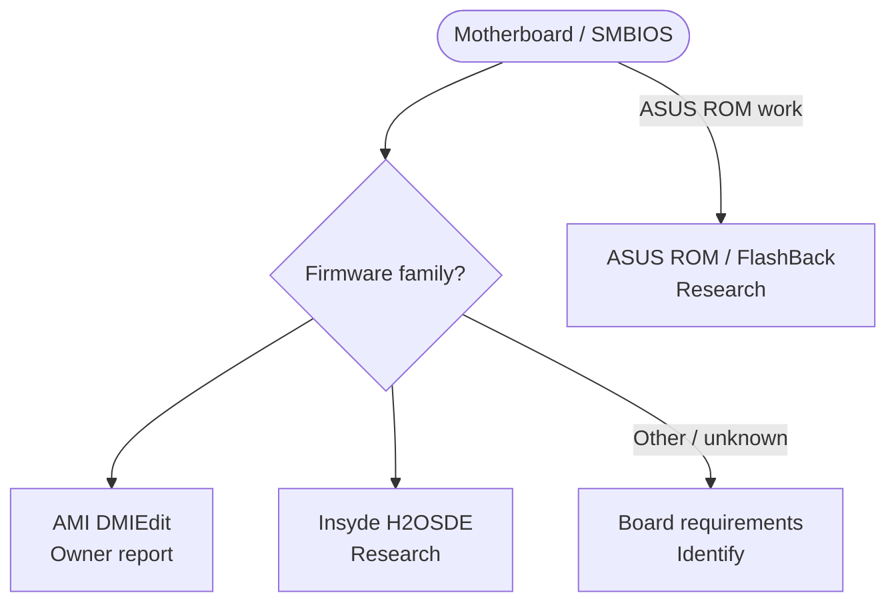

<!-- Generated from site/.vitepress/theme/journey-data.ts by site/scripts/journey-pages.mjs. Edit the metadata owner; review --json output and apply it explicitly. -->

# Motherboard guide chooser

Identify the fields, exact firmware and recovery route before choosing board-specific work.

- **Identify:** [Identify the SMBIOS fields](../../guides/motherboard-spoofing/motherboard-spoofing.md#what-this-changes)
- **Prepare:** [Requirements and recovery](../../guides/motherboard-spoofing/motherboard-spoofing.md#requirements-and-recovery-preparation)
- **Full guide:** [Motherboard and SMBIOS](../../guides/motherboard-spoofing/motherboard-spoofing.md)
- **Verify:** [Verify SMBIOS after cold boot](../../guides/motherboard-spoofing/motherboard-spoofing.md#verify-with-hwidchecker)

## Choose your route

## Identify & recover

- [SMBIOS fields](../../guides/motherboard-spoofing/motherboard-spoofing.md#what-this-changes) (background). **SMBIOS structure and field explanation**
- [Identify & recover](../../guides/motherboard-spoofing/motherboard-spoofing.md#requirements-and-recovery-preparation) (preparation). **Exact model, revision, BIOS and recovery are required** A rejected write or unsupported board remains a stop condition.
  Topic names: Unknown, protected or unsupported board.

## AMI tools

- [AMI DMIEdit](../../guides/motherboard-spoofing/motherboard-spoofing.md#instructions) (procedure). **Owner hardware report; other-board compatibility unverified** Read recovery preparation and review every command before writing.
  Topic names: AMI board: owner-tested DMIEdit workflow.
- [AMI scope & limits](../../guides/motherboard-spoofing/motherboard-spoofing.md#amidewin-and-dmiedit-workflow-notes) (background). **Command scope and compatibility limits** Supporting notes for the AMI workflow, not a second independent procedure.
  Topic names: AMIDEWIN / DMIEdit scope and limits.

## OEM / board research

- [Insyde / H2OSDE](../../guides/motherboard-spoofing/motherboard-spoofing.md#insyde-h2osde-and-oem-provisioning-tools) (research). **Tool existence documented; end-user availability unverified** Model-specific OEM provisioning; no general Phoenix procedure is confirmed.
  Topic names: Insyde H2OSDE and OEM provisioning.
- [ASUS ROM boundary](../../guides/motherboard-spoofing/motherboard-spoofing.md#asus-specific-procedure-boundary) (research). **Official recovery documented; modified-ROM procedure untested** A readable dump does not validate a modified image or a flash.
  Topic names: ASUS: FlashBack and modified-ROM boundary.

[Home](../home.md) · [Complete work order](../start.md) · [All hardware topics](../devices.md) · [Reference](../reference.md)
