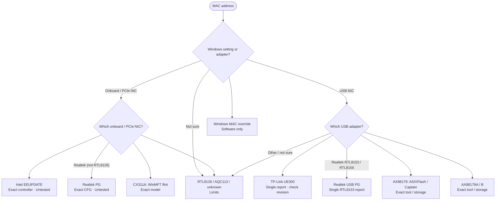

<!-- Generated from site/.vitepress/theme/journey-data.ts by site/scripts/journey-pages.mjs. Edit the metadata owner; review --json output and apply it explicitly. -->

# NIC / MAC guide chooser

Choose a Windows override or your NIC. Device programming depends on the exact controller, tool and storage.

- **Identify:** [Current, permanent and stored MAC](../../guides/mac-spoofing/mac-spoofing.md#current-mac-permanent-mac-and-burned-in-storage)
- **Prepare:** [Backups and recovery checklist](../../guides/getting-started/getting-started.md#safety-checklist)
- **Full guide:** [NIC and MAC addresses](../../guides/mac-spoofing/mac-spoofing.md)
- **Verify:** [Verify current and device readbacks](../../guides/mac-spoofing/mac-spoofing.md#verification-checklist)

## Choose your route

## Windows and address layers

- [Address layers](../../guides/mac-spoofing/mac-spoofing.md#current-mac-permanent-mac-and-burned-in-storage) (background). **Current, permanent and stored addresses are separate views**
- [Software override](../../guides/mac-spoofing/mac-spoofing.md#windows-networkaddress-override-software-only) (procedure). **Documented Windows mechanism; driver support varies** Changes the current address without rewriting NIC storage; applying it restarts the adapter.
  Topic names: Windows NetworkAddress: software-only override.

## Internal / PCIe

- [Intel EEUPDATE](../../guides/mac-spoofing/mac-spoofing.md#intel-nics) (procedure). **General programming procedure untested** Exact controller, utility version, locks and backup caveats apply.
  Topic names: Intel Ethernet: EEUPDATE / DOS route.
- [Realtek PG](../../guides/mac-spoofing/mac-spoofing.md#realtek-nics) (procedure). **General workflow untested; exact silicon / configuration required** RTL8125-family configuration does not establish RTL8126 support.
  Topic names: Realtek onboard / PCIe: matched PG configuration.
- [ConnectX-3](../../guides/mac-spoofing/mac-spoofing.md#mellanox-connectx-3-cx311a--mcx311a-xcat) (procedure). **Named CX311A single-port hardware test** Read WinOF / WinMFT Prerequisites, firmware backup and image-file checks before flashing.
  Topic names: Mellanox ConnectX-3 CX311A / MCX311A-XCAT.

## USB adapters

- [RTL8153 / RTL8156](../../guides/mac-spoofing/mac-spoofing.md#realtek-usb-nics-update) (research). **Named Belkin RTL8153 contributor report; not repeated here** The tool-version and OTP/eFuse limits remain explicit; do not extend the report to every RTL8156 adapter.
  Topic names: Realtek RTL8153 / RTL8156 USB adapters.
- [TP-Link UE300](../../guides/mac-spoofing/mac-spoofing.md#tp-link-ue300--rtl8153) (research). **One report; revision and active storage unconfirmed** Record the printed revision and matched hardware before considering its cautious Realtek workflow.
  Topic names: TP-Link UE300 / RTL8153: revision-sensitive report.
- [ASIX AX88179](../../guides/mac-spoofing/mac-spoofing.md#asix-ax88179ab-now-too) (research). **Third-party Captain report; exact controller / storage required** External EEPROM and embedded eFuse are different storage paths.
  Topic names: ASIX AX88179: original-controller route.
- [AX88179A / B](../../guides/mac-spoofing/mac-spoofing.md#ax88179-storage-and-captain-tool-detail) (background). **Vendor storage model; exact tooling / adapter support required** A/B bundled-tool limits are not a vendor-wide rule. eFuse cannot be erased.
  Topic names: ASIX AX88179A / AX88179B: revision and storage.

## RTL8126 / AQC113 / other

- [Controller storage & limits](../../guides/mac-spoofing/mac-spoofing.md#controller-storage-efuse-eeprom-or-flash) (limitation). **RTL8126 factory provisioning / AQC113 recovery / unknown storage** One shared section. Exact controller/card, adapter revision, hardware IDs, tool version and storage mode are needed; no generic detection commands are added.
  Topic names: Realtek RTL8126: factory provisioning boundary; Marvell / Aquantia AQC113: recovery, not MAC editing; Unknown NIC or unknown storage mode.

[Home](../home.md) · [Complete work order](../start.md) · [All hardware topics](../devices.md) · [Reference](../reference.md)
