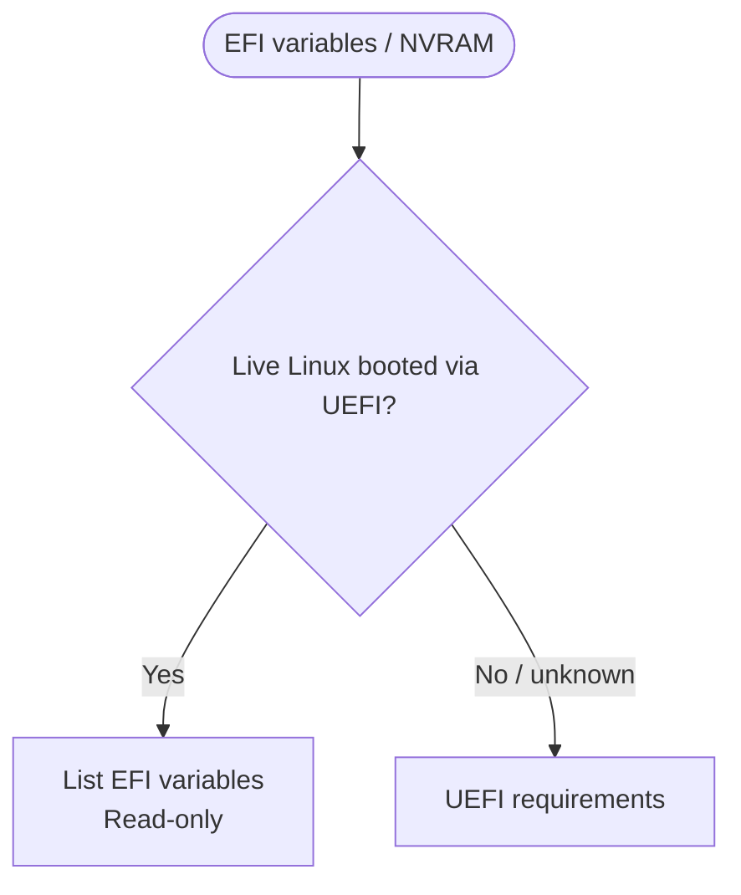

<!-- Generated from site/.vitepress/theme/journey-data.ts by site/scripts/journey-pages.mjs. Edit the metadata owner; review --json output and apply it explicitly. -->

# EFI variables guide chooser

Inspect variables read-only and keep boot configuration separate from reported identity-like names.

- **Identify:** [Understand variable names and roles](../../guides/nvram-spoofing/nvram-spoofing.md#what-the-variables-mean)
- **Prepare:** [Backup and recovery preparation](../../guides/nvram-spoofing/nvram-spoofing.md#backup-and-recovery-preparation)
- **Full guide:** [NVRAM and EFI variables](../../guides/nvram-spoofing/nvram-spoofing.md)
- **Verify:** [Compare EFI and SMBIOS evidence](../../guides/nvram-spoofing/nvram-spoofing.md#verify-with-hwidchecker)

## Choose your route

## Inspect

- [Requirements](../../guides/nvram-spoofing/nvram-spoofing.md#requirements) (preparation). **Native UEFI and read-only evidence preparation**
- [UEFI inventory](../../guides/nvram-spoofing/nvram-spoofing.md#read-only-inspection-steps) (procedure). **Documented read-only inspection** HWIDChecker does not enumerate arbitrary EFI variables.
  Topic names: UEFI system: read-only efivarfs inventory.

## Interpret the inventory

- [Boot variables](../../guides/nvram-spoofing/nvram-spoofing.md#standard-boot-variables) (background). **Standard boot configuration, not motherboard serials**
  Topic names: BootOrder, Boot#### and other boot variables.
- [Reported ID names](../../guides/nvram-spoofing/nvram-spoofing.md#identifier-like-variables-reported-in-third-party-research) (research). **Third-party reported meanings remain unverified** A variable name does not establish its contents or purpose.
  Topic names: OfflineUniqueID, UnlockID, DmiVar and MacAddrVar.

## Write / delete limits

- [Write / delete limits](../../guides/nvram-spoofing/nvram-spoofing.md#why-this-guide-does-not-delete-variables) (limitation). **No verified generic deletion or restore procedure** Only an exact vendor-supported procedure could establish a supported change.
  Topic names: Unknown write or deletion: unsupported boundary.

[Home](../home.md) · [Complete work order](../start.md) · [All hardware topics](../devices.md) · [Reference](../reference.md)
