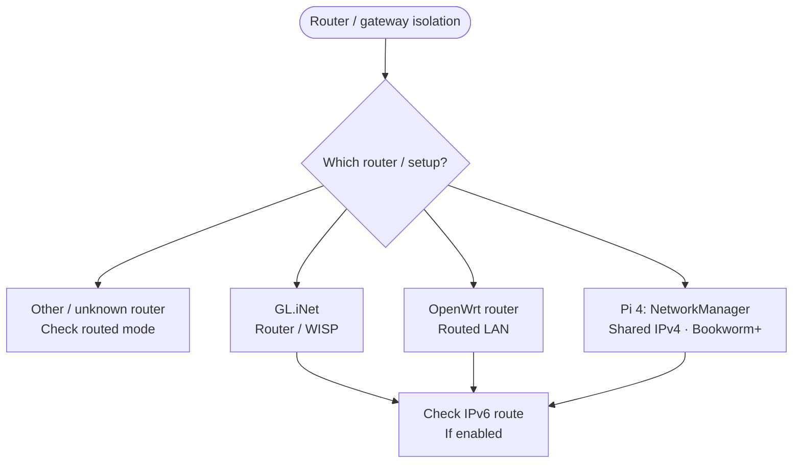

<!-- Generated from site/.vitepress/theme/journey-data.ts by site/scripts/journey-pages.mjs. Edit the metadata owner; review --json output and apply it explicitly. -->

# Router / gateway guide chooser

Use a router you own or administer in routed mode. Choose its setup, then check the gateway and IPv6 if enabled.

- **Identify:** [Compare the routed device options](../../guides/arp-spoofing/arp-spoofing.md#options)
- **Prepare:** [Requirements and reset access](../../guides/arp-spoofing/arp-spoofing.md#requirements)
- **Full guide:** [Router and first-hop network isolation](../../guides/arp-spoofing/arp-spoofing.md)
- **Verify:** [Verify gateway and neighbor tables](../../guides/arp-spoofing/arp-spoofing.md#verify-with-hwidchecker)
- **Before choosing:** [Record Windows baseline](../../guides/arp-spoofing/arp-spoofing.md#1-record-the-baseline-on-windows-a)
- **Before choosing:** [Routed topology](../../guides/arp-spoofing/arp-spoofing.md#2-build-the-routed-topology-a)

## Choose your route

## Before configuration

- [Record Windows baseline](../../guides/arp-spoofing/arp-spoofing.md#1-record-the-baseline-on-windows-a) (preparation). **Record routes, gateway and IPv4 / IPv6 neighbors** For Wi-Fi also record the current association. Keep real network identifiers outside the repository.
- [Routed topology](../../guides/arp-spoofing/arp-spoofing.md#2-build-the-routed-topology-a) (preparation). **Separate routed uplink / downstream required** Read Requirements before choosing a device configuration.

## Configure

- [GL.iNet](../../guides/arp-spoofing/arp-spoofing.md#3a-configure-a-glinet-travel-router-a) (procedure). **Vendor-documented Router / WISP configuration** The uplink MAC control alone does not change the PC-visible LAN gateway MAC.
  Topic names: GL.iNet travel router: Router / WISP mode.
- [OpenWrt](../../guides/arp-spoofing/arp-spoofing.md#3b-configure-another-openwrt-router-a) (procedure). **Documented exact LAN-device configuration** Device names and port layouts vary; do not assume an anonymous interface index.
  Topic names: Supported OpenWrt router.
- [Raspberry Pi 4](../../guides/arp-spoofing/arp-spoofing.md#3c-configure-a-raspberry-pi-4-model-b-a) (procedure). **Documented Wi-Fi-uplink / Ethernet-downstream IPv4 example** An all-wired topology needs a second supported interface. This is routing, not bridging.
  Topic names: Raspberry Pi 4: NetworkManager shared IPv4.

## Boundary & after-route checks

- [Routed vs bridge](../../guides/arp-spoofing/arp-spoofing.md#overview) (identification). **Routing boundary explanation; not a generic router recipe**
  Topic names: Unknown router or bridge / access-point setup.
- [IPv6 boundary](../../guides/arp-spoofing/arp-spoofing.md#4-decide-how-to-handle-ipv6-a) (verification). **Separate required after-route IPv6 check** No universal GL.iNet / OpenWrt IPv6 toggle is established.
  Topic names: IPv6: verify the separate routed boundary.

[Home](../home.md) · [Complete work order](../start.md) · [All hardware topics](../devices.md) · [Reference](../reference.md)
