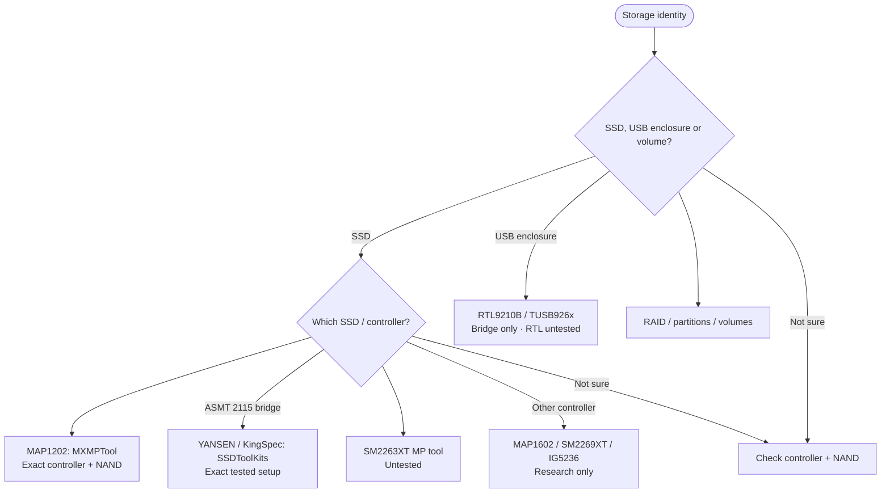

<!-- Generated from site/.vitepress/theme/journey-data.ts by site/scripts/journey-pages.mjs. Edit the metadata owner; review --json output and apply it explicitly. -->

# Storage guide chooser

Choose your SSD, enclosure or volume. Match the controller, NAND, revision and connection before SSD work.

- **Identify:** [Identify the exact controller](../../guides/ssd-spoofing/ssd-spoofing.md#which-controller-do-i-have)
- **Prepare:** [Backups and recovery checklist](../../guides/getting-started/getting-started.md#safety-checklist)
- **Full guide:** [SSD, storage controllers and USB bridges](../../guides/ssd-spoofing/ssd-spoofing.md)
- **Verify:** [Verify every storage layer](../../guides/ssd-spoofing/ssd-spoofing.md#verify-the-result)

## Choose your route

## Native drive routes

- [MAP1202](../../guides/ssd-spoofing/ssd-spoofing.md#m2-ssd-spoofing) (procedure). **Owner-tested MAP1202 setup; not independently repeated** Read the destructive-operation warning and local Prerequisites. Match controller and NAND, not just the retail name.
  Topic names: Maxio MAP1202: M.2 NVMe owner-tested workflow.
- [YANSEN / KingSpec SATA](../../guides/ssd-spoofing/ssd-spoofing.md#normal-25-ssd-spoofing) (procedure). **Owner-tested drive / ASMT 2115 setup; other stock unverified** Read the SATA warning and Prerequisites; the retail listing does not establish a controller or NAND match.
  Topic names: YANSEN / KingSpec: 2.5-inch SATA workflow.
- [SM2263XT research](../../guides/ssd-spoofing/ssd-spoofing.md#silicon-motion-sm2263xt-notes) (research). **Controller-specific programming procedure untested** Controller, NAND and exact PCB revision must match the package.
  Topic names: Silicon Motion SM2263XT: untested MP workflow.

## Bridge / logical layers

- [RTL9210B / TUSB926x](../../guides/ssd-spoofing/ssd-spoofing.md#usb-nvme-enclosures-and-bridge-serials) (research). **RTL bridge workflow untested; TI descriptor example documented** One shared section. Neither changes the native SSD behind the bridge.
  Topic names: RTL9210B enclosure: USB / SCSI bridge identity; TI TUSB926x: documented bridge-descriptor example.
- [RAID / volumes](../../guides/ssd-spoofing/ssd-spoofing.md#raid-disk-identity-and-volume-identity) (background). **Logical identities are separate from native drive identity**
  Topic names: RAID, virtual disks, partitions and volumes.

## Other controllers

- [MAP1602 / SM2269XT / IG5236 / limits](../../guides/ssd-spoofing/ssd-spoofing.md#research-candidates) (research). **Bring-up / recovery evidence; no guide-supported identity change** Shared table for MAP1602, SM2269XT, IG5236, Realtek NVMe and Phison. No separate identity-write recipes.
  Topic names: Maxio MAP1602: bring-up research only; Silicon Motion SM2269XT: bring-up research only; InnoGrit IG5236: recovery evidence only; Realtek NVMe / Phison: unsupported identity change.

## Identify controller

- [Identify controller](../../guides/ssd-spoofing/ssd-spoofing.md#which-controller-do-i-have) (identification). **Exact controller, NAND, revision, firmware and transport required** Stop if the package is hidden or the match cannot be confirmed.
  Topic names: Unknown controller, NAND or bridge.

[Home](../home.md) · [Complete work order](../start.md) · [All hardware topics](../devices.md) · [Reference](../reference.md)
