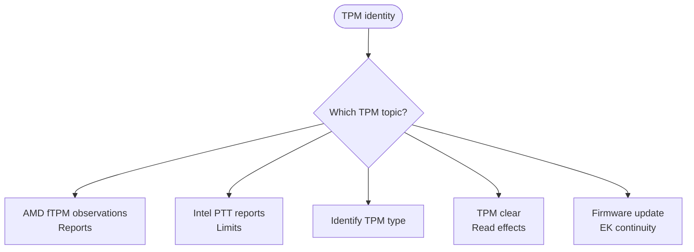

<!-- Generated from site/.vitepress/theme/journey-data.ts by site/scripts/journey-pages.mjs. Edit the metadata owner; review --json output and apply it explicitly. -->

# TPM guide chooser

Identify the active implementation and distinguish protected state, endorsement keys and certificates.

- **Identify:** [Identify the TPM implementation](../../guides/tpm-spoofing/tpm-spoofing.md#tpm-implementation-types)
- **Prepare:** [TPM key and sign-in precautions](../../guides/tpm-spoofing/tpm-spoofing.md#what-clearing-the-tpm-changes)
- **Full guide:** [TPM identity and implementation](../../guides/tpm-spoofing/tpm-spoofing.md)
- **Verify:** [Verify the EK and certificate collections](../../guides/tpm-spoofing/tpm-spoofing.md#verify-with-hwidcheckerexe)

## Choose your route

## Implementation

- [dTPM / Pluton types](../../guides/tpm-spoofing/tpm-spoofing.md#tpm-implementation-types) (identification). **Implementation table, not separate rotation procedures** Confirm the active implementation in firmware or device documentation.
  Topic names: Discrete TPM chip or plug-in module; Microsoft Pluton configured as TPM.

## State & identity

- [Clear limits](../../guides/tpm-spoofing/tpm-spoofing.md#what-clearing-the-tpm-changes) (limitation). **Standard clear changes storage state, not EPS / default EK** Read the key, recovery and alternate sign-in precautions.
  Topic names: Ordinary TPM clear: state, not EK rotation.
- [Update continuity](../../guides/tpm-spoofing/tpm-spoofing.md#firmware-updates-and-ek-continuity) (background). **Firmware-version change alone does not prove a new standard EK**
  Topic names: Firmware update and EK continuity.

## Related fTPM chapter

- [AMD fTPM evidence](../../guides/resets/ftpm-reset-tutorial.md#how-the-amd-ftpm-identity-actually-works) (background). **AMD observations and derivation limits; fTPM chapter** Opens the fTPM guide. Exact derivation inputs remain undocumented.
  Topic names: AMD ASP fTPM.
- [Intel generation limits](../../guides/resets/ftpm-reset-tutorial.md#intel-z790-vs-z790-era-method-vs-z890) (limitation). **Generation-specific evidence; fTPM chapter** Shared canonical section with ftpm-intel-z890. Do not generalize the MSI Z790 report.
  Topic names: Intel Platform Trust Technology (PTT).

[Home](../home.md) · [Complete work order](../start.md) · [All hardware topics](../devices.md) · [Reference](../reference.md)
