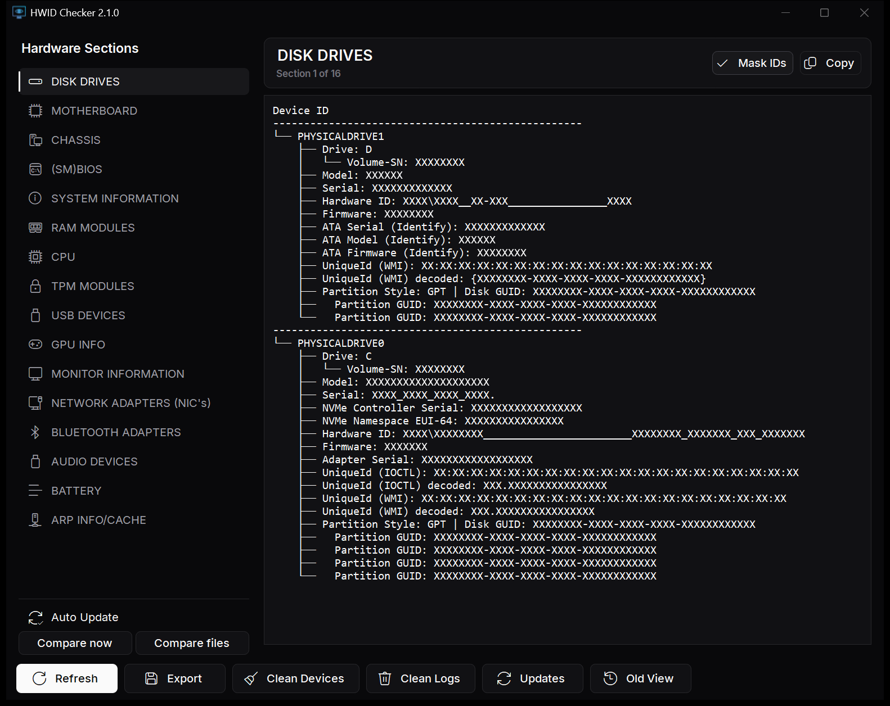
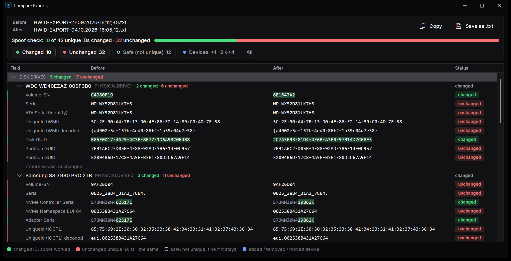

# HWID Privacy

Understand the identifiers your Windows PC exposes, then find the guide for your exact hardware and the observation you care about. Each route keeps its preparation, limitations and evidence with the full instructions.

[How to read the evidence grades](/guides/getting-started/getting-started.html#how-to-read-these-guides)

<WikiHome />

## HWIDChecker

Native Windows 10/11 app, no runtime needed, administrator rights on every launch. It displays the hardware identifiers it can collect, exports them as text, and compares an export with the current system.

[Download HWIDChecker.exe](https://github.com/Fundryi/HWID-Privacy/raw/main/HWIDChecker.exe) · [How to take before and after snapshots](/guides/getting-started/getting-started#hwidcheckerexe)

