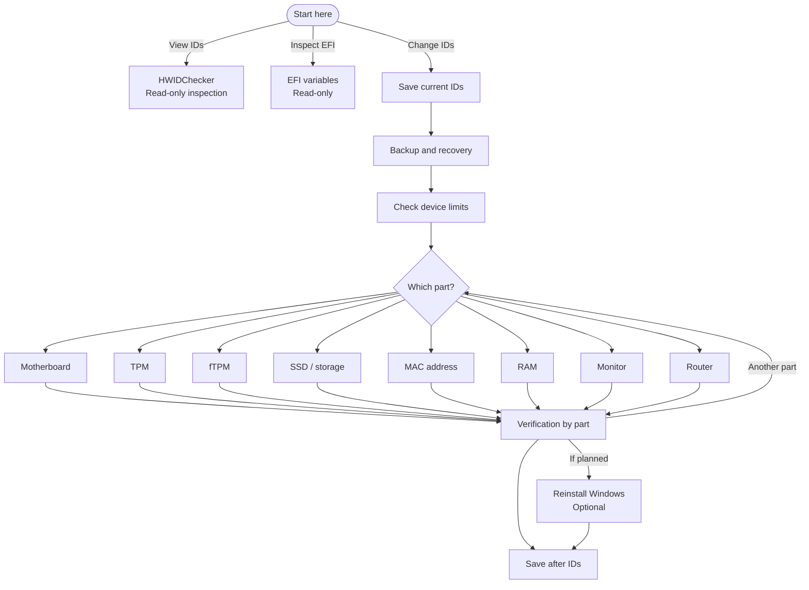

# Start here

Use the flowchart to plan one component or a wider project. Click a linked box to open its guide or checklist. The full steps, warnings and sources stay in the detailed guides.

## Guide map

<!-- start-overview:begin -->

<!-- start-overview:end -->

For several components, follow the [work order below](#work-order). Use each component guide's preparation and verification checks.

## Choose how to begin

- [Learn what an HWID is](/guides/getting-started/getting-started.html#what-an-hwid-is)
- [See the IDs on your PC with HWIDChecker](/guides/getting-started/getting-started.html#hwidcheckerexe)
- [Go straight to a component](/devices.html)

## Work order

> [!WARNING]
> This sequence is a project workflow, not a universal vendor procedure. It has not been validated on every platform and is **[S]**. Any firmware or device write keeps the evidence grade and warning from its dedicated guide. Do not use this summary as a write procedure.

<WorkflowMap />

[Read the full step list](/guides/getting-started/getting-started.html#plan-the-work-in-the-right-order)

The full Getting Started guide also covers [identifier groups](/guides/getting-started/getting-started.html#identifier-groups), [device restrictions](/guides/getting-started/getting-started.html#device-restrictions) and [recovery preparation](/guides/getting-started/getting-started.html#safety-checklist).
